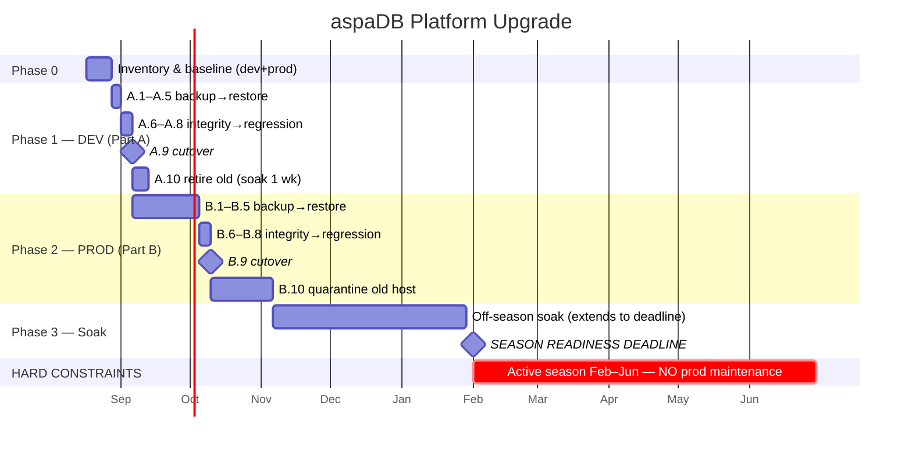
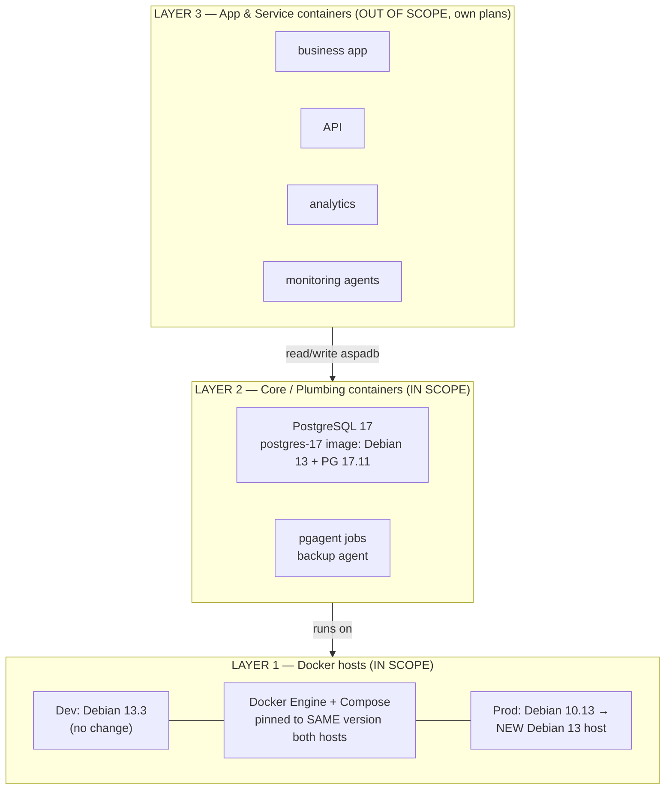
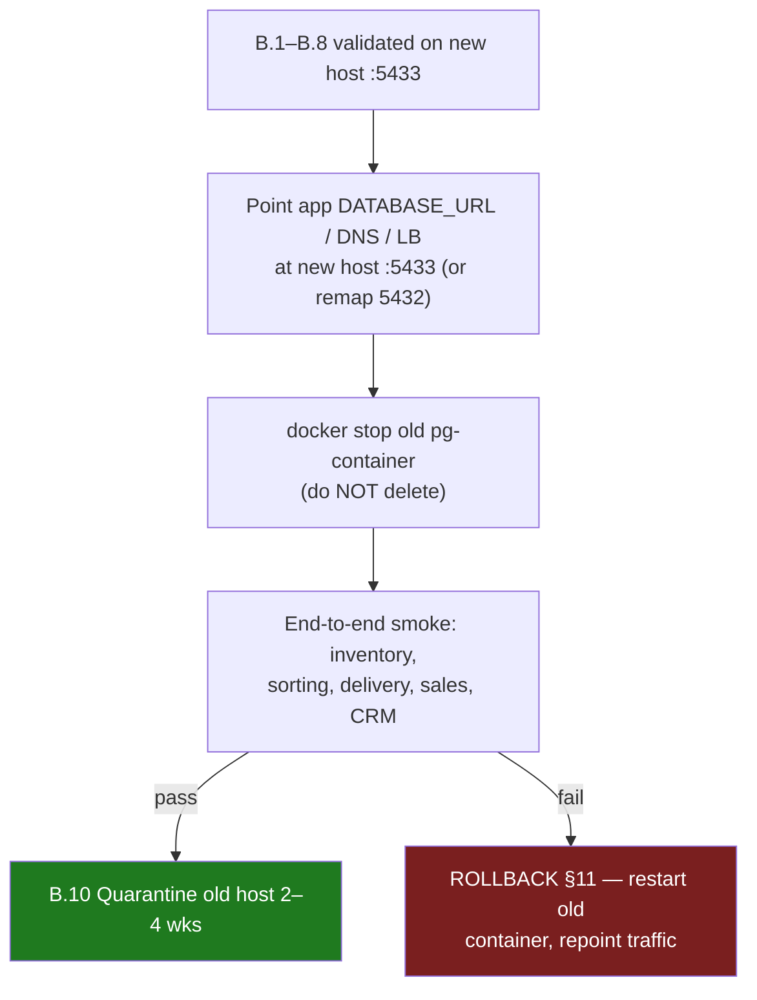

# PostgreSQL 12.13 → 17.11 Upgrade Guide (Debian 10/13 → Debian 13)

**Project**: aspaDB-workbench | **Path**: docs/CORE-PLATFORM-UPGRADE.md
**Version**: v1.8.0 | **Last Updated**: 2026-08-15
**Author**: Manfred Koroschetz/AI
**License**: SPDX-License-Identifier: MIT

## Changelog
- v1.8.0 (2026-08-15): Backup/restore steps now use the **in-repo tooling** — `workbench/scripts/pg_backup.sh --verify` (A.1/B.1) and `restore-cluster.sh` (A.5/B.5) — instead of ad-hoc pg_dump; recorded freshest full backup **2026-08-11** in §5; updated system-reference §5.
- v1.7.0 (2026-08-15): Added Mermaid diagrams — §2 Gantt schedule (phases, milestones, Feb 2027 deadline, Feb–Jun no-maintenance window), §3.1 stack-layer flowchart (replaces ASCII art), §8 Part A dev upgrade flow, §9.9 prod cutover flow with rollback branch.
- v1.6.0 (2026-08-15): Added §2 Status Tracker — current status, phase checklist, milestone dates, and Execution History tables. Renumbered sections (§2→§3 … §11→§12); updated all cross-references.
- v1.5.1 (2026-08-15): Renamed document to `docs/CORE-PLATFORM-UPGRADE.md` (prominent core project doc); updated Path header + cross-references.
- v1.5.0 (2026-08-15): Added Scope & Architecture section (§3) — layered container stack (host → plumbing/DB → app/service), interface contract for app/service plans, coordination & sequencing. Renumbered sections (§2→§3 … §10→§11).
- v1.4.0 (2026-08-15): Added seasonal operating model — prod active only Feb–Jun. Prod upgrade scheduled in off-season (Jul–Jan) with hard deadline before Feb 2027; downtime cost ≈ 0 then; risk row for deadline slip; soak may span the whole off-season (§1, §6, §9, §12).
- v1.3.0 (2026-08-15): Added Docker Engine/Compose version-sync policy — both Docker hosts must run identical Docker versions; inventory baseline (§5), risk row (§6), path policy (§7), pinned install on new prod host (B.2), validation matrix row 12.
- v1.2.0 (2026-08-15): Prod topology clarified — Docker host Debian 10.13 (EOL) + PG container Debian 11.6. Rewrote Part B as new Debian 13 Docker host + reuse of the dev-built PG 17 image + dump/restore; updated exec summary, §4.1, risks, validation matrix, rollback.
- v1.1.0 (2026-08-15): Clarified dev topology — Docker host Debian 13.3, PG container Debian 11.6 (Bullseye, LTS ends 2026-08-31). Rewrote Part A as container rebuild on Debian 13 + PG 17 with dump/restore; replaced pg_upgrade rationale with dump/restore rationale (§4.3); updated risks, validation matrix, rollback.
- v1.0.0 (2026-08-15): Initial guide — PG 12.13 → 17.11 on Debian 13. Dev first (in-place pg_upgrade), then prod (fresh install + restore). Checkpoint at every step.

---

## 1. Executive Summary

**Current state is unsupported and must move.**

| Env | Host | OS | PostgreSQL | OS Status | PG Status |
|-----|------|-----|-----------|-----------|-----------|
| Dev | 192.168.100.32 — Docker host **Debian 13.3**; **PG container Debian 11.6 (Bullseye)** | Debian 11.6 (in container) | 12.13 | ❌ **Bullseye LTS ends 2026-08-31** (host itself OK on 13.x) | ❌ **EOL since 2024-11-21** |
| Prod | 172.20.61.220 — Docker host **Debian 10.13 (Buster)**; **PG container Debian 11.6 (Bullseye)** | Debian 11.6 (in container) | 12.13 | ❌ **Host EOL since 2024-06-30**; **container Bullseye LTS ends 2026-08-31** | ❌ **EOL since 2024-11-21** |

**Recommendations (rationale in §4):**
1. **OS → Debian 13 (Trixie)** — current stable, supported to 2028 + LTS to 2030. Applies to the **prod Docker host**, the **dev container base image**, and the **prod container base image** (the dev Docker host is already on 13.3).
2. **PostgreSQL → 17.11** — Debian 13's *default* package (no external repo), 2 years mature, supported to **Nov 2029**.

**Strategy:**
- **Dev (container rebuild):** rebuild the PG container image on **Debian 13 + PG 17** (Docker host stays 13.3), migrate data via **logical dump/restore** — the most reliable path for a container-to-container, cross-OS move. Full regression test before prod.
- **Prod (host + container + PG all change):** because everything runs in containers, the Docker host is **disposable infrastructure** → stand up a **new Docker host on Debian 13**, deploy the **same image validated on dev**, restore the dump. No in-place OS migration on Debian 10.

**Golden rule:** Dev fully validated → prod. Prod: **verify backup before touching anything**. Any step fails → STOP → rollback (§11).

**Operational calendar (critical for scheduling):** Prod is **in active service only Feb–Jun** each year. Outside that window prod carries **no live business load**, so:
- The upgrade should run in the **off-season** (Jul–Jan) — downtime cost is effectively **zero**.
- **Hard deadline: complete prod upgrade + soak BEFORE the next season (Feb 2027).**
- Backup cadence (crontab Feb + June) brackets the season — a fresh backup is still mandatory (§B.1), and the June end-of-season backup is the most recent data marker.
- Suggested target window for prod (Part B): **Sep–Oct 2026**, with dev (Part A) done first — e.g. **Aug–Sep 2026**.

---

## 2. Status Tracker

> **Keep this section current.** Update after each checkpoint and after each executed step. This is the single source of truth for where the upgrade stands. Owned by: **Manfred Koroschetz**.

### Current status

| Env | Phase | Status | Last updated | Next action |
|-----|-------|--------|--------------|-------------|
| Dev (Part A) | Phase 1 — planned | 🔲 Not started | 2026-08-15 | Run §5 inventory |
| Prod (Part B) | Phase 2 — planned | 🔲 Not started | 2026-08-15 | Wait for dev to pass Phase 1 |

### Phase checklist

| Phase | Scope | Checkpoints | Status |
|-------|-------|-------------|--------|
| **Phase 0** | §5 inventory + backup baseline | §4 baseline recorded; Docker versions captured (§5); DB size known | 🔲 |
| **Phase 1 — DEV** | Part A (A.1–A.10) | A.1–A.10 all ✅ (§8) | 🔲 |
| **Phase 2 — PROD** | Part B (B.1–B.10) | B.1–B.10 all ✅ (§9) | 🔲 |
| **Phase 3** | Full-stack soak + season readiness | Validation matrix §10 all ☐→☑; soak complete; Feb 2027 deadline met | 🔲 |

### Key milestone dates (target vs. actual)

| Milestone | Target | Actual |
|-----------|--------|--------|
| §5 inventory complete | Aug 2026 | |
| Dev cutover (A.9) | Sep 2026 | |
| Dev retire (A.10) | Oct 2026 | |
| Prod cutover (B.9) | Oct 2026 | |
| Prod quarantine end (B.10) | Nov 2026 | |
| **Season readiness (deadline)** | **Feb 2027** | |

### Schedule (Gantt)



### Execution History

> One row per executed step — record date, who, deviations, and result. Keeps the runbook honest and reusable for the next PG major.

| Step | Date | Executed by | Deviations | Result | Notes |
|------|------|-------------|------------|--------|-------|
| *(planned)* A.1 backup | | | | | |
| *(planned)* A.2 container config | | | | | |
| *(planned)* A.3 build image | | | | | |
| *(planned)* A.4 side container + locale | | | | | |
| *(planned)* A.5 restore | | | | | |
| *(planned)* A.6 integrity check | | | | | |
| *(planned)* A.7 extensions/config | | | | | |
| *(planned)* A.8 regression | | | | | |
| *(planned)* A.9 cutover | | | | | |
| *(planned)* A.10 retire old | | | | | |
| *(planned)* B.1 pre-flight backup | | | | | |
| *(planned)* B.2 new host + Docker pin | | | | | |
| *(planned)* B.3 deploy image | | | | | |
| *(planned)* B.4 side container + locale | | | | | |
| *(planned)* B.5 restore | | | | | |
| *(planned)* B.6 integrity check | | | | | |
| *(planned)* B.7 extensions/config | | | | | |
| *(planned)* B.8 regression | | | | | |
| *(planned)* B.9 cutover | | | | | |
| *(planned)* B.10 quarantine old host | | | | | |

---

## 3. Scope & Architecture (layered container stack)

> **This guide is the PLUMBING layer.** It upgrades the shared infrastructure that everything else runs on: the Docker hosts, the Docker Engine, the PostgreSQL 17 image, and the database data. The **service and application containers** that sit on top of this stack have their **own, separate maintenance/upgrade plans** and are **out of scope here** — this section defines the boundary and the interface contract they must honor.

### 3.1 Stack layers



> **Layering:** L3 containers have their **own plans** and are out of scope here. This guide upgrades L2 + L1 (the plumbing), which establishes the contract L3 must satisfy (§3.3).

### 3.2 Why this guide is scoped to plumbing only

- The DB is the **single point of truth** for all containers — every service/app reads and writes `aspadb`. Upgrading it is the highest-risk, must-go-first step; it must be **independently verifiable** without app-layer noise.
- App/service containers have **different lifecycles, owners, and release cadences** than infrastructure. Folding them in would make this plan unmaintainable and tie DB rollout to unrelated changes.
- The plumbing upgrade **establishes the contract** everything else must satisfy; app plans then slot in against a stable, tested base (below).

### 3.3 Interface contract (what the app/service plans must honor)

Each service/app container upgrade plan MUST satisfy these contracts before/after this plumbing upgrade:

| # | Contract | Requirement | Checked at |
|---|----------|-------------|------------|
| 1 | **PG 17 client/driver compatibility** | All app DB drivers/clients (psycopg, JDBC, PDO, node-postgres, etc.) must support PG 17 wire protocol + behave under PG 17. Verify per-container in its own plan | App regression §A.8 / §B.8 |
| 2 | **Same Docker Engine/Compose version** | Containers must run on the pinned host Docker version (§7). No container plan may assume a newer/older engine | Host provisioning §B.2 |
| 3 | **Image provenance** | App images must be built on a Debian 13 base (or a base explicitly compatible with the target host) and pulled from the project registry/tag | Per app plan |
| 4 | **Connection/DNS changes** | On prod cutover (§B.9), app containers must point at the new PG endpoint (host:5433→5432). Each plan must expose where its `DATABASE_URL`/env is set | §B.9 cutover |
| 5 | **Schema compatibility** | No app plan may run DDL (schema/data migrations) against `aspadb` *during* the plumbing migration window (A.5–A.9 / B.5–B.9) | Scheduling (A/B) |
| 6 | **Read-only access during migration** | `reporter`/`grafana_user` access patterns must keep working post-upgrade; app plans must not rely on superuser access | §A.6 / §B.6 |

### 3.4 Coordination & sequencing (plumbing vs. app plans)

```
Phase 0   Plumbing inventory + baseline (§5)          →  app plans run their OWN inventories in parallel
Phase 1   DEV plumbing upgrade (Part A, §8)           →  AFTER plumbing: app/service plans upgrade against dev PG 17
Phase 2   PROD plumbing upgrade (Part B, §9)           →  AFTER plumbing: app/service plans upgrade against prod PG 17
Phase 3   Full-stack soak + season-readiness (§12)     →  all layers validated together before Feb 2027
```

- **Dev ordering is strict:** plumbing first, app layers after — so app plans validate against a real PG 17 base.
- **Prod ordering is strict:** plumbing cutover (§B.9) is a **dependency** for any app container that touches `aspadb`. Coordinate each app plan's cutover to follow B.9 in the same off-season window.
- **Docker version changes** are a host-layer concern; both host and app plans must defer to the §7 sync policy.

---

## 4. Version Recommendations & Rationale

### 4.1 Why Debian 13 (Trixie)

| Candidate | Support until | Verdict |
|-----------|--------------|---------|
| **Debian 13 (Trixie)** — current stable, 13.6 | 2028 + LTS to 2030-06 | ✅ **Recommended** (prod host **and** both container base images) |
| Debian 12 (Bookworm) — oldstable | LTS to 2028-06 | ❌ Already near its own LTS end |
| Debian 11 (Bullseye) — current container base in both envs | LTS ends 2026-08-31 | ❌ ~2 weeks left; do not rebuild on it |
| Stay on Debian 10 (Buster) — current prod host | EOL (paid ELTS only) | ❌ Unsupported, security risk |

- **Dev Docker host** (192.168.100.32) is already on Debian 13.3 → **no host migration**, only `apt full-upgrade` to 13.6 as housekeeping.
- **Dev PG container** runs Debian 11.6 (Bullseye) — LTS ends **2026-08-31** → the container **base image must be rebuilt on Debian 13** as part of this upgrade (§8).
- **Prod Docker host** (172.20.61.220) runs Debian 10.13 (Buster) — **EOL since 2024-06-30** → replaced with a **new Debian 13 host** (§9), not upgraded in place (10→13 is 3 releases; containers make the host disposable).
- **Prod PG container** also runs Debian 11.6 (Bullseye) → rebuilt on Debian 13 using the **same image** validated on dev (§9.3).

### 4.2 Why PostgreSQL 17.11 (not 16, not 18)

| Version | Released | EOL | Maturity | Verdict |
|---------|----------|-----|----------|---------|
| **17.11** | 2024-09-26 | **2029-11-08** | 2 yrs, very stable | ✅ **Recommended** |
| 16.15 | 2023-09-14 | 2028-11-09 | 3 yrs, most conservative | ⚠️ Fallback (shorter runway) |
| 18.6 | 2025-09-25 | 2030-11-14 | ~11 months | ❌ Too new for reliability-first migration |

Key reasons for **17**:
- Ships **by default in Debian 13** (`postgresql-17`) — no PGDG repo needed for prod.
- Well past the "new major" risk window; minor 17.11 has ~2 years of fixes.
- Longest practical support (to 2029) while staying on a proven major.
- PG 17 brings meaningful perf (improved VACUUM, incremental base backups, `COPY` with row filtering) — free wins for the 85-table `aspa` schema.

### 4.3 Why dump/restore, not pg_upgrade

`pg_upgrade` requires the old and new binaries to run **on the same OS** (both data dirs mounted to one host with matching locale). Neither environment qualifies here:
- **Dev:** container base image changes Debian 11 → 13 → run `pg_upgrade` across two containers on different OS bases is possible but fragile; dump/restore in a fresh container is cleaner.
- **Prod:** the Docker host is replaced (Debian 10 → 13) and the container base changes too — a fresh host + dump/restore is the only sane path.

A logical dump also doubles as a **regression baseline** (row counts, `reporter` queries) and survives the OS change without collation cross-version surprises. For 85 tables / one app DB, restore time is minutes — no reason to accept pg_upgrade complexity.

---

## 5. Current State Inventory

Run once and record results in the validation log.

```bash
# On each host (as postgres OS user or superuser)
# Dev: run inside the PG container (docker exec -it <pg-container> bash); record container OS via cat /etc/debian_version
psql -U mkoroschetz -d aspadb -c "SELECT version();"
psql -U mkoroschetz -d aspadb -c "SHOW lc_collate; SHOW lc_ctype; SHOW server_encoding;"
psql -U mkoroschetz -d aspadb -c "SHOW shared_preload_libraries;"   # expect pg_stat_statements
psql -U mkoroschetz -d aspadb -c "SELECT datname FROM pg_database ORDER BY 1;"
psql -U mkoroschetz -d aspadb -c "SELECT extname, extversion FROM pg_extension ORDER BY 1;"
psql -U mkoroschetz -d aspadb -c "SELECT nspname FROM pg_namespace ORDER BY 1;"
# schemas: aspa (app, 85 tables), public, tax_reports, winery
psql -U mkoroschetz -d aspadb -c "SELECT rolname FROM pg_roles WHERE rolname IN ('mkoroschetz','reporter','grafana_user') ORDER BY 1;"
# Docker version sync baseline (run on BOTH Docker hosts — dev and prod MUST match)
docker --version
docker compose version
docker info --format '{{.ServerVersion}} | {{.Driver}}'
```
**Dev baseline recorded 2026-08-15:** Docker Engine **29.3.0** (build 5927d80) · Docker Compose **v5.1.0** · Server **29.3.0** · driver **overlay2** · data root `/mnt/docker-data`. Prod must match these exactly (B.2).

**Known constraints (from project technical domain):**
- Locale: prod `en_US.utf8` / `libc`; dev `C.UTF-8`. **The new cluster MUST reuse the old locale/provider** — otherwise restored text sorts differently (top collation risk in this upgrade).
- Roles: `mkoroschetz` (superuser), `reporter` (read-only), `grafana_user` (monitoring).
- Extensions: `pg_stat_statements` (shared_preload), `pgagent` (job scheduling).
- Backup tooling (in-repo, `workbench/scripts/`): `pg_backup.sh` (+ rotated variant), `pg_restore.sh`, `restore-cluster.sh`, config `pg_backup.config`. Restore order: **globals → postgres → aspadb** (per `restore-cluster.sh`).
- Backup cadence: crontab `6 4 * 2,6 *` (Feb + Jun) on the DB host. **Freshest full backup available: 2026-08-11** (refined scripts, logged in `workbench/scripts/log/pg_backup.log`).
- **Docker version sync:** both Docker hosts must run the **same Docker Engine + Compose version** and the same storage driver. Dev and prod must stay pinned to one version until both are validated, then move together (see §7, B.2).

---

## 6. Known Risks & Mitigations

| Risk | Impact | Mitigation |
|------|--------|-----------|
| Locale/encoding mismatch (en_US.utf8 vs C.UTF-8) | Wrong collation / sort order on restored data | Verify `SHOW lc_collate` on new cluster matches old; restore to a cluster with identical locale (§A.4 / §B.4) |
| `public` schema permission change (PG 15+) | Apps assuming world-writable `public` break | Already hardened (`REVOKE CREATE ON public`); verify after restore |
| Extensions (`pg_stat_statements`, `pgagent`) not carried by dump | Monitoring/jobs missing | Recreate extensions in PG 17 (§A.7 / §B.7); reconcile shared_preload_libraries |
| `reporter`/`grafana_user` grants lost | Analytics breaks | `pg_dumpall --globals-only` covers roles; re-grant/verify §A.6 / §B.8 |
| Soft-delete convention (`deleted = false`) | Regression queries returning soft-deleted rows | Part of app regression suite (§A.8) |
| Stale backups (crontab Feb + June) | Restore may be months old | Take a **fresh backup immediately** before upgrade (step A.1 / B.1) |
| Long downtime on prod | Business impact | Prod is active only Feb–Jun → schedule upgrade in the **off-season** (Jul–Jan); downtime cost ≈ 0 then. Dry-run the restore on dev/temp VM first |
| Deadline slip past Feb 2027 | Upgrade forced into the active season = real business cost | Front-load Part B in Sep–Oct 2026; leave Oct–Dec as contingency; never touch prod Feb–Jun |
| Prod host (Debian 10.13) EOL | No security patches on the Docker host itself | Replace with new Debian 13 host (§9), not in-place upgrade |
| Container base (Debian 11) EOL in both envs | Unpatched CVEs if deferred past 2026-08-31 | Rebuild both containers on Debian 13 (Part A / Part B) |
| Docker Engine / Compose version drift between dev and prod | Image/compose/naming incompatibilities; dev passes, prod fails | Pin the same Docker Engine + Compose version on both hosts (§5, §7, B.2); upgrade together |

---

## 7. Upgrade Path Decision

```
DEV:  Docker host Debian 13.3 (no change) ──► rebuild PG container image: Debian 13 + PG 17.11 ──► dump/restore data  [container rebuild]
PROD: Docker host Debian 10.13 (EOL) ──► NEW Docker host Debian 13 ──► same PG 17.11 image ──► dump/restore data  [new host + container rebuild]
```

**Docker version sync policy (mandatory):**
1. Record the Docker Engine + Compose version on **both** hosts during inventory (§5). They are the **baseline**.
2. On the new prod host (B.2), install the **same** Docker Engine + Compose version as dev. If a newer version is required by the fresh install, upgrade dev to match **first**, then rebuild/validate, then deploy to prod. Dev is the pace-setter; prod follows.
3. Keep both hosts on the **same pinned version** through the 2–4 week soak (§12). Do not bump one host independently.

---

## 8. Part A — DEV Upgrade (container rebuild on Debian 13 + PG 17)

> Dev = **Docker host 192.168.100.32 (Debian 13.3)** running a **PG container on Debian 11.6 (Bullseye, LTS ends 2026-08-31)** with **PG 12.13**. Both the container base image and PG are EOL → rebuild the image on Debian 13 + PG 17 and migrate data by **logical dump/restore** into a fresh container. Save all command output to a dated log. **Each step has a CHECKPOINT — do not advance until it passes.**


### A.1 — Fresh backup (mandatory, even in dev)

Use the **in-repo backup tooling** (`workbench/scripts/pg_backup.sh`), which produces `globals.sql.gz` + per-DB `.custom`/`.sql.gz` in a dated dir and is verified by `restore-cluster.sh`. The freshest full backup is **2026-08-11**; still run a fresh one now.

```bash
# on the Docker host, in workbench/scripts (or wherever pg_backup.sh is deployed)
./pg_backup.sh -m pre-upgrade-dev --verify
# produces: <date>-pre-upgrade-dev/globals.sql.gz + aspadb.custom + aspadb.sql.gz (+ postgres DB)
# copy off-host: host + container + external dual copy
scp -r /mnt/data/aspadata/DB-Backup/*-pre-upgrade-dev/ backup@remote:/backup/
ls -lh /mnt/data/aspadata/DB-Backup/*-pre-upgrade-dev/   # globals.sql.gz + aspadb.custom non-empty
```

✅ **CHECKPOINT A.1:** backup dir dated today with `globals.sql.gz` + `aspadb.custom` non-empty; `--verify` passed (`pg_restore -l` OK); `globals.sql.gz` contains `mkoroschetz`, `reporter`, `grafana_user`; copied off-host.

### A.2 — Record current container configuration

```bash
docker inspect <pg-container> > container-config.json   # image, ports, volumes, env, restart policy
docker ps --filter name=<pg-container>                  # port mappings (expect 5432)
cat /etc/postgresql/12/main/postgresql.conf | grep -vE '^\s*#|^\s*$'   # tuning to carry over
```

✅ **CHECKPOINT A.2:** container config (image tag, env vars, volume mounts, port bindings, restart policy) and `postgresql.conf` tuning captured for reuse.

### A.3 — Build new container image (Debian 13 + PG 17)

```bash
# Dockerfile for the new image (adjust base per repo convention; Debian 13 = trixie)
FROM debian:13
RUN apt-get update && apt-get install -y \
      postgresql-17 postgresql-17-pgagent postgresql-contrib \
    && rm -rf /var/lib/apt/lists/*

docker build -t aspadb-postgres:17 .
```

✅ **CHECKPOINT A.3:** image builds cleanly; `docker run --rm aspadb-postgres:17 pg_config --version` → **17.11**; image base reports Debian 13.

### A.4 — Run new container on a side port (5433)

```bash
docker run -d --name pg17 \
  -e POSTGRES_PASSWORD='***' \
  -p 5433:5432 \
  --restart unless-stopped \
  aspadb-postgres:17
# verify
docker exec pg17 cat /etc/debian_version          # 13.x
docker exec pg17 psql -U postgres -c "SELECT version();"
docker exec pg17 psql -U postgres -c "SHOW lc_collate; SHOW lc_ctype; SHOW server_encoding;"
```

✅ **CHECKPOINT A.4:** new container runs on **5433** (old stays on 5432 — zero risk); `version()` = 17.11; locale/encoding recorded (should match old: dev `C.UTF-8`/`UTF8`).

### A.5 — Restore into new container (order: globals → postgres → aspadb)

Use the **in-repo restore tooling** (`workbench/scripts/restore-cluster.sh`), which restores globals → postgres → every DB in the correct order, then runs ANALYZE/VACUUM. For dev transfer use `--no-owner --no-privileges` (prod→dev roles/owners differ).

```bash
# copy the backup dir into the new container (or run the restore from the host against 5433)
docker cp <date>-pre-upgrade-dev pg17:/tmp/
docker exec pg17 /workbench/scripts/restore-cluster.sh /tmp/<date>-pre-upgrade-dev/ --no-owner --no-privileges
# or, from the host, point pg_restore.sh at the side port:
./workbench/scripts/pg_restore.sh -a /mnt/data/aspadata/DB-Backup/<date>-pre-upgrade-dev/ -c <config-dev5433>
```

✅ **CHECKPOINT A.5:** `restore-cluster.sh` reports success; `aspadb` DB exists owned by `mkoroschetz`; `reporter`/`grafana_user` roles present; ANALYZE/VACUUM pass ran.

### A.6 — Verify data integrity on PG 17

```bash
docker exec pg17 psql -U postgres -d aspadb -c "SELECT count(*) FROM information_schema.tables WHERE table_schema='aspa';"
docker exec pg17 psql -U postgres -d aspadb -c "SELECT nspname FROM pg_namespace ORDER BY 1;"
docker exec pg17 psql -U postgres -d aspadb -c "SELECT rolname FROM pg_roles WHERE rolname IN ('mkoroschetz','reporter','grafana_user') ORDER BY 1;"
docker exec pg17 psql -U postgres -d aspadb -c "SELECT count(*) FROM aspa.inventory WHERE deleted = false;"
```

✅ **CHECKPOINT A.6:** 85 tables in `aspa`; schemas `public`, `tax_reports`, `winery` present; all 3 roles exist; inventory row count matches pre-upgrade value (recorded in §5).

### A.7 — Extensions & config reconciliation

```bash
docker exec pg17 psql -U postgres -d aspadb -c "CREATE EXTENSION IF NOT EXISTS pg_stat_statements;"
docker exec pg17 psql -U postgres -d aspadb -c "CREATE EXTENSION IF NOT EXISTS pgagent;"
# apply pg_stat_statements shared_preload, then restart:
docker exec pg17 bash -c "echo \"shared_preload_libraries='pg_stat_statements'\" >> /etc/postgresql/17/main/postgresql.conf"
docker exec pg17 psql -U postgres -d aspadb -c "ALTER SYSTEM SET shared_preload_libraries='pg_stat_statements';"
docker restart pg17
docker exec pg17 psql -U postgres -c "SHOW shared_preload_libraries;"
```

✅ **CHECKPOINT A.7:** `\dx` shows pg_stat_statements + pgagent; `SHOW shared_preload_libraries;` → `pg_stat_statements`; performance tuning carried over from A.2.

### A.8 — Full regression against dev apps (port 5433)

Run the entire workbench/query suite and app smoke tests **against the new container on 5433**:
```bash
workbench/scripts/run.sh -e dev -p 5433 query.sql     # repeat for schema-analysis/*.sql and app calls
psql -h 192.168.100.32 -p 5433 -U reporter -d aspadb -c "SELECT count(*) FROM aspa.inventory WHERE deleted = false;"
psql -h 192.168.100.32 -p 5433 -U grafana_user -d aspadb -c "SELECT 1;"   # monitoring user works
```

✅ **CHECKPOINT A.8:** all queries return identical results vs. old-container (5432) baseline; `reporter` + `grafana_user` authenticate; pgagent schedules run.

### A.9 — Cut over: switch app to PG 17 container

```bash
# stop old container (do NOT delete yet)
docker stop <pg-container>
# update the app / .env.dev DATABASE_URL / compose service to point at pg17 on 5433 (or remap to 5432)
# example: docker compose service image aspadb-postgres:17, ports 5433:5432
# adjust run.sh -e dev profile port accordingly
```

✅ **CHECKPOINT A.9:** app connects to PG 17 container; end-to-end flow works; no errors in application logs; old container stopped but intact.

### A.10 — Retire old container (after 1 week soak)

```bash
docker rm <pg-container>        # or keep until soak passes; then purge old image
docker rmi <old-image>          # remove Debian-11/PG12 image after confirmed stable
```

✅ **CHECKPOINT A.10:** `docker ps` shows only `pg17`; old image removed; disk reclaimed. **Dev upgrade COMPLETE.**

---

## 9. Part B — PROD Upgrade (new Docker host on Debian 13 + rebuilt container + restore)

> Prod = **Docker host 172.20.61.220 (Debian 10.13, EOL)** running a **PG container on Debian 11.6 (Bullseye, LTS ends 2026-08-31)** with **PG 12.13**. Host, container base, and PG are all EOL. Because everything runs in containers, the Docker host is **disposable** → build a **new Docker host on Debian 13**, run the **same PG 17 image built and validated on dev (§8)**, and restore the dump. **Schedule this in the off-season (Jul–Jan); prod is active only Feb–Jun, so the maintenance window carries no business cost if done then.** **Each step has a CHECKPOINT — do not advance until it passes.**

### B.1 — Full pre-flight backup (do NOT skip)

Use the **in-repo backup tooling** (`workbench/scripts/pg_backup.sh`) — same script as dev. It produces `globals.sql.gz` + per-DB `.custom`/`.sql.gz` in a dated dir and self-verifies with `--verify`. Restore is done by `restore-cluster.sh`.

```bash
# 1) fresh full backup via the in-repo tool (from the DB host or via docker exec)
./workbench/scripts/pg_backup.sh -m pre-upgrade-prod --verify
# 2) copy backup dir OFF the server — dual copy (host + external storage) required
BACKUP_DIR_LATEST=$(ls -dt /mnt/data/aspadata/DB-Backup/*pre-upgrade-prod | head -1)
sha256sum "$BACKUP_DIR_LATEST"/globals.sql.gz "$BACKUP_DIR_LATEST"/aspadb.custom > checksums.txt
scp -r "$BACKUP_DIR_LATEST"/ backup@remote:/backup/   # or rsync off-host
# 3) capture container config for exact replication
docker inspect <pg-container> > container-config.json     # ports, volumes, env, restart policy
docker ps --filter name=<pg-container>                    # record port mapping (expect 5432)
```

✅ **CHECKPOINT B.1:** backup dir dated today with `globals.sql.gz` + `aspadb.custom` non-empty; `--verify` passed; checksums exist **on-host and off-host**; `globals.sql.gz` contains `mkoroschetz`, `reporter`, `grafana_user`; `container-config.json` captured.

### B.2 — Provision new Docker host on Debian 13 (same IP/DNS)

- Install Debian 13 (Trixie) minimal server; `apt full-upgrade` to latest point release (13.6+).
- Install Docker Engine; bring the network/IP and hostname to match old (or update DNS/LB).
- **Install the SAME Docker Engine + Compose version as dev** (§5 baseline / §7 sync policy). If the fresh Debian 13 host ships a newer Docker, upgrade dev to that version **first**, validate, then match it here — never let prod run a higher Docker version than dev.
- Apply any host-level tuning carried from old `/etc/sysctl.conf` if the app depends on it.

```bash
sudo apt update && sudo apt full-upgrade -y
cat /etc/debian_version          # expect 13.x
# match dev's Docker version exactly (replace X.Y.Z with dev's version from §5)
sudo apt install -y docker.io=X.Y.Z docker-compose-v2  # or pin via apt-mark hold
sudo systemctl enable --now docker
# verify sync — must equal dev's output from §5
docker --version && docker compose version
docker info --format '{{.ServerVersion}} | {{.Driver}}'
```

✅ **CHECKPOINT B.2:** fresh Debian 13 host boots, Docker Engine running, SSH hardening in place, same reachable IP/DNS as before, `debian_version` = 13.x, **Docker Engine + Compose version IDENTICAL to dev** (engine, server version, storage driver).

### B.3 — Deploy the same PG 17 image (built on dev)

```bash
# Reuse the exact image validated in §8 — no rebuild on prod
docker load -i aspadb-postgres-17.tar       # or: pull from a registry
docker images | grep aspadb-postgres         # confirm tag aspadb-postgres:17
```

✅ **CHECKPOINT B.3:** image `aspadb-postgres:17` present; same image digest as dev (build once, reuse in both envs — zero divergence).

### B.4 — Run new container on side port (5433) + verify locale

```bash
docker run -d --name pg17 \
  -e POSTGRES_PASSWORD='***' \
  -p 5433:5432 \
  --restart unless-stopped \
  aspadb-postgres:17
# verify
docker exec pg17 cat /etc/debian_version          # 13.x
docker exec pg17 psql -U postgres -c "SELECT version();"
docker exec pg17 psql -U postgres -c "SHOW lc_collate; SHOW lc_ctype; SHOW server_encoding;"
```

✅ **CHECKPOINT B.4:** new container on **5433** (old untouched on 5432); `version()` = **17.11**; locale/encoding recorded and must match old prod (`en_US.utf8`/`UTF8`). If locale differs → re-init the data dir with `locale-gen` + re-initdb before restore.

### B.5 — Restore into new container (order: globals → postgres → aspadb)

Use the **in-repo restore tooling** (`workbench/scripts/restore-cluster.sh`) — same tool as dev. Same-host prod restore keeps owners/privileges (no `--no-owner`/`--no-privileges`).

```bash
# copy the backup dir into the new container, then restore the full cluster
docker cp <date>-pre-upgrade-prod pg17:/tmp/
docker exec pg17 /workbench/scripts/restore-cluster.sh /tmp/<date>-pre-upgrade-prod/
# or, from the new host, point pg_restore.sh at the side port:
./workbench/scripts/pg_restore.sh -a /mnt/data/aspadata/DB-Backup/<date>-pre-upgrade-prod/ -c <config-prod5433>
```

✅ **CHECKPOINT B.5:** `restore-cluster.sh` reports success; `aspadb` DB exists owned by `mkoroschetz`; roles + owners preserved (no `--no-owner`); ANALYZE/VACUUM pass ran.

### B.6 — Data integrity verification on PG 17

```bash
docker exec pg17 psql -U postgres -d aspadb -c "SELECT count(*) FROM information_schema.tables WHERE table_schema='aspa';"
docker exec pg17 psql -U postgres -d aspadb -c "SELECT nspname FROM pg_namespace ORDER BY 1;"
docker exec pg17 psql -U postgres -d aspadb -c "SELECT rolname FROM pg_roles WHERE rolname IN ('mkoroschetz','reporter','grafana_user') ORDER BY 1;"
docker exec pg17 psql -U postgres -d aspadb -c "SELECT count(*) FROM aspa.inventory WHERE deleted = false;"
```

✅ **CHECKPOINT B.6:** 85 tables in `aspa`; schemas `public`, `tax_reports`, `winery` present; all 3 roles exist; inventory row count matches pre-upgrade baseline (recorded in §5).

### B.7 — Extensions & config reconciliation

```bash
docker exec pg17 psql -U postgres -d aspadb -c "CREATE EXTENSION IF NOT EXISTS pg_stat_statements;"
docker exec pg17 psql -U postgres -d aspadb -c "CREATE EXTENSION IF NOT EXISTS pgagent;"
docker exec pg17 psql -U postgres -d aspadb -c "ALTER SYSTEM SET shared_preload_libraries='pg_stat_statements';"
docker restart pg17
docker exec pg17 psql -U postgres -c "SHOW shared_preload_libraries;"
# apply production tuning from old postgresql.conf (work_mem, shared_buffers, effective_cache_size…) via ALTER SYSTEM
```

✅ **CHECKPOINT B.7:** `\dx` shows pg_stat_statements + pgagent; `SHOW shared_preload_libraries;` → `pg_stat_statements`; performance tuning matches old prod; pgagent schedules visible.

### B.8 — App + analytics regression (read-only first)

```bash
workbench/scripts/run.sh -e prod -p 5433 query.sql     # app query suite against new container
psql -h 172.20.61.220 -p 5433 -U reporter -d aspadb -c "SELECT count(*) FROM aspa.inventory WHERE deleted = false;"
psql -h 172.20.61.220 -p 5433 -U grafana_user -d aspadb -c "SELECT 1;"
# Compare row counts / checksums vs. pre-upgrade numbers recorded in B.1
```

✅ **CHECKPOINT B.8:** all queries return identical results to pre-upgrade baseline; `reporter` and `grafana_user` authenticate; no `permission denied` errors.

### B.9 — Cutover: switch production traffic



```bash
# Update DATABASE_URL in app config / env / DNS / LB to point at new host:5433 (or remap to 5432)
# Point the app's other containers at the new PG container (docker network / compose)
docker stop <pg-container>        # old container stopped — do NOT delete yet
```

✅ **CHECKPOINT B.9:** application fully operational on PG 17; end-to-end business flows pass (inventory, sorting, delivery, sales, CRM smoke tests); monitoring dashboards (Grafana) showing data.

### B.10 — Quarantine old host (retain for rollback window)

- Keep old Debian 10 host **offline but intact** for 2–4 weeks (rollback window, §11).
- Do **not** purge old backups until post-upgrade soak passes.

✅ **CHECKPOINT B.10:** old host preserved; no scheduled jobs still pointing at it; new host fully authoritative.

---

## 10. Post-Upgrade Validation Matrix (both environments)

| # | Check | Dev | Prod |
|---|-------|-----|------|
| 1 | `SELECT version();` → 17.11 | ☐ | ☐ |
| 2 | Only PG 17 container running in both envs (after A.10 / B.10) | ☐ | ☐ |
| 3 | Locale: en_US.utf8 / UTF8 / libc (prod), C.UTF-8 (dev) | ☐ | ☐ |
| 4 | 85 tables in `aspa`; schemas public/tax_reports/winery present | ☐ | ☐ |
| 5 | Roles mkoroschetz/reporter/grafana_user + grants OK | ☐ | ☐ |
| 6 | pg_stat_statements + pgagent loaded | ☐ | ☐ |
| 7 | `reporter` read-only SELECT works | ☐ | ☐ |
| 8 | Row counts match pre-upgrade baseline | ☐ | ☐ |
| 9 | App smoke tests (inventory/sorting/delivery/sales/CRM) pass | ☐ | ☐ |
| 10 | Backups running on new schedule (crontab on new prod host) | ☐ | ☐ |
| 11 | Monitoring (Grafana/pgagent) reporting | ☐ | ☐ |
| 12 | **Docker Engine + Compose version identical on dev and prod** (engine, server, storage driver) | ☐ | ☐ |
| 13 | Old container (dev) / old host (prod) quarantined / dropped (after soak) | ☐ | ☐ |

---

## 11. Rollback Plan

**Trigger:** any checkpoint fails with no acceptable mitigation, or app regression fails after cutover.

**Dev (A):** old container is only *stopped* at A.9, never deleted until A.10 → **restart the old container and point the app back**. The old data volume is untouched throughout.

```bash
docker start <pg-container>        # old PG 12 / Debian 11 container
# revert app DATABASE_URL / run.sh -e dev port to the old container → done. (Then investigate; never force-forward.)
```

**Prod (B):**
1. Re-route app/DNS back to the old host (kept intact in B.10) and restart the old PG container.
2. Old PG 12 container is untouched → start it, business resumes from pre-upgrade state.
3. Loss window = time between B.1 dump and B.9 cutover → **any writes in that window must be re-entered or reconciled**; keep B.9 cutover as short as possible and do it in the maintenance window.
4. Investigate root cause; do not re-attempt until fixed (rollback is never a race).

---

## 12. Monitoring & Follow-up (first 4 weeks)

- **Daily:** `pg_stat_statements` top queries; vacuum/autovacuum activity (`pg_stat_progress_vacuum`); pgagent job success.
- **Weekly:** `SELECT * FROM pg_stat_activity;` for blocked sessions; check Grafana dashboards for anomaly.
- **After soak (2–4 wks):** purge old backups, drop old host, update this guide's version header + changelog, and record the decision in `.opencode/context/project-intelligence/decisions-log.md` (template: Context / Decision / Rationale / Alternatives / Impact).

**Seasonal scheduling notes:**
- Soak window may span the entire off-season (Jul–Jan) if preferred — there is **no rush and no business risk** in extending it, and a long soak (months) on an idle prod is the safest possible validation before the Feb–Jun season.
- **Do not** schedule the prod cutover (B.9) inside Feb–Jun. If the season starts before the upgrade completes, **hold** — leave prod on PG 12 for the season rather than risk a mid-season migration, and upgrade the following off-season.
- Align the post-upgrade regression (§B.8) with realistic season queries — import a sample of last season's workload (inventory, sorting, delivery, sales, CRM) for a meaningful soak.

**Known follow-ups (defer, don't forget):**
- Consider PG 18 or 19 in the next planned lifecycle window (no sooner than mid-2027 — also align with off-season).
- Revisit `--clone` (reflink) option on future pg_upgrade if storage supports CoW.
- **Docker version sync:** any future Docker Engine/Compose bump must be applied to **both** hosts together — upgrade dev first, validate, then prod (same policy as §7).
