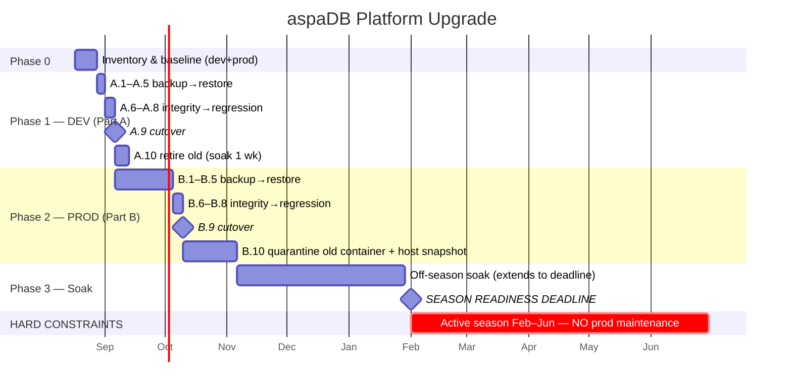
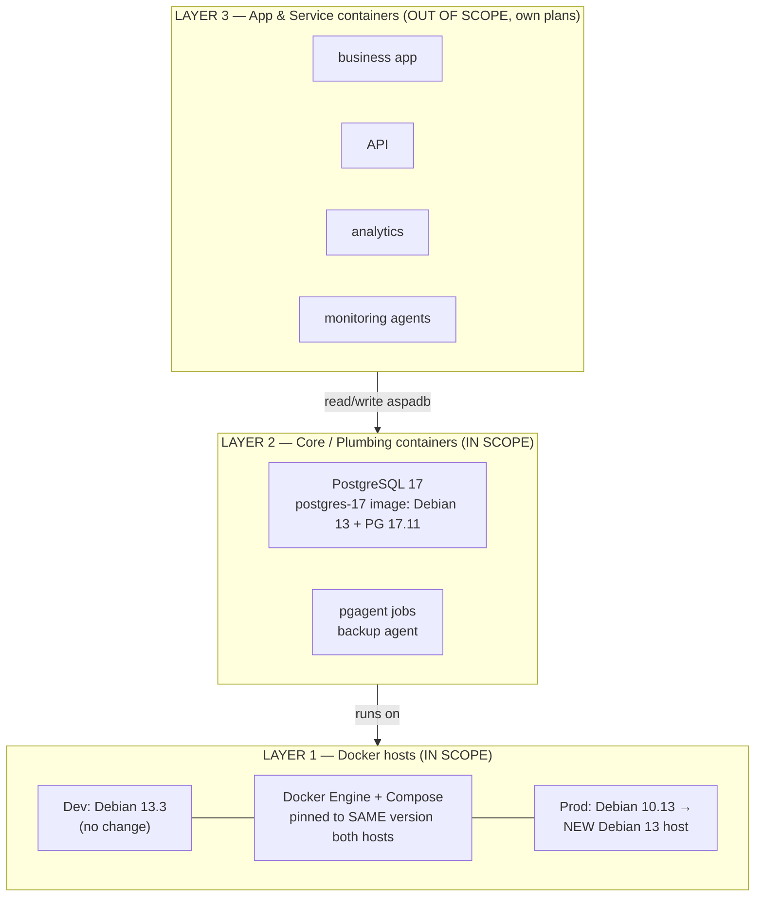
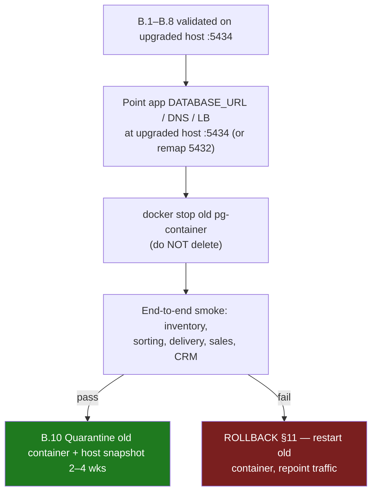

# PostgreSQL 12.13 → 17.11 Upgrade Guide (Debian 10/13 → Debian 13)

**Project**: aspaDB-workbench | **Path**: docs/CORE-PLATFORM-UPGRADE.md
**Version**: v1.11.3 | **Last Updated**: 2026-08-18
**Author**: Manfred Koroschetz/AI
**License**: SPDX-License-Identifier: MIT

## Changelog
- v1.11.3 (2026-08-18): **Phase 2 strategy change — prod host upgraded IN PLACE, not replaced.** Per user decision (A1 note), Part B no longer provisions a **new Docker host**; the existing prod host (172.20.61.220) is upgraded **in place**: (1) **OS upgrade** Debian 10.13 → 13.x (Trixie 13.3+, sequential 10→11→12→13 release upgrades) and (2) **Docker upgrade** 26.1.4/v2.27.0 → **29.3.0/v5.1.0** to match dev exactly (§7 sync policy). B.2 rewritten accordingly with a new **host-level snapshot/backup precondition** (the rollback anchor, since the host is no longer disposable); B.10 redefined as quarantine of the **old PG container + pre-upgrade host snapshot**; §1/§2/§4.1/§5/§6/§7/§9/§10/§11/§12 updated for consistency; new §6 risk row for the in-place 3-release OS upgrade. Container rebuild + dump/restore strategy unchanged.
- v1.11.2 (2026-08-18): **Prod inventory + baseline recorded (§5) — Phase 0 ✅ complete.** Captured on prod host (172.20.61.220): Docker Engine **26.1.4** (build 5650f9b) · Compose **v2.27.0** · driver **overlay2** · host Debian **10.13** (EOL); `aspadb` DB size **339 MB** (dev: 255 MB); container config via `docker inspect aspaDB` (postgres:12.13, 5432:5432, unless-stopped, iotstack_default 172.30.4.19, binds incl. `/mnt/data/aspadata/DB-Backup` → `/mnt/DB-Backup`); pg_hba.conf (scram-sha-256 for 172.20.61.0/24, 192.168.1.0/24, 192.168.61.0/24, 172.30.0.0/16 + open `all all all` fallback; replication trust on localhost). ⚠️ **Docker version mismatch recorded: prod 26.1.4/v2.27.0 vs dev 29.3.0/v5.1.0 — B.2 must pin the new prod host to 29.3.0/v5.1.0.** Prod container name is `aspaDB` (capital DB) vs dev `aspadb` lowercase. Milestone actuals filled: §5 inventory 2026-08-18, A.9 cutover 2026-08-17, A.10 retire 2026-08-18.
- v1.11.1 (2026-08-18): **Dev crontab fixed for the PG17 era** (follow-up to A.10). The dev crontab still ran the old host-side backup entries (`/mnt/data/aspadata/DB-Backup/*.sh`), which can no longer reach the DB — the postgres17 container has no host socket mount. Applied the A.9 post-cutover cron change: all 4 DB jobs now run **in-container** via `docker exec -u postgres aspadb /mnt/DB-Backup/<script>` (container name is `aspadb` lowercase — the doc's earlier `aspaDB`/`postgres17` examples were wrong and would not resolve). Prerequisites discovered + fixed: (1) the backup tooling (scripts + `pg_backup.config` + `.pgpass`) must live in the **container-mounted** dir (host `<IOTstack>/DB_Backup` → in-container `/mnt/DB-Backup`) — copied there; (2) the mounted dir + `log/` + `.pgpass` must be writable by the container `postgres` user (UID 999) — chowned; (3) `pg_backup.config` `DOCKER_COMPOSE_DIR` must point at the in-container path `/mnt/DB-Backup/` with a synced `docker-compose.yml` (the live compose under `/root/IOTstack/` is unreachable in-container, `/root` is 700) — updated + synced. **All 4 cron scripts verified in-container (exit 0)**: pg_maintenance (ANALYZE+VACUUM all 9 DBs), pg_backup (full cluster, plain+custom+globals+configs+compose snapshot), pg_backup_rotated, aspa_IngresCleanup. Script headers updated (pg_maintenance v1.2.1, pg_backup v1.6.2, pg_backup_rotated v1.1.1, aspa_IngresCleanup v1.1.1) and re-deployed to both host dirs. Validation matrix row 10 dev → ☑. **Part B (prod) must apply the same cron change at B.9** — see §B.9 note.
- v1.11.0 (2026-08-18): **A.10 executed — dev upgrade COMPLETE (Phase 1 ✅)**. The old PG 12.13 container (`aspaDB-old`, stopped since the A.9 cutover) was reinstated on **side port 5435** with its original data volume for validation, then retired: (1) reinstated container booted cleanly (PG 12.13, `en_US.utf8`, 11 DBs incl. `aspadb`); (2) regression suite (`regression-list.sql`, all 4 tiers) ran against 5435 with **0 ERROR lines** on the *current-era* objects — the only failures were 7 `does not exist` errors for objects created after the old volume's 2025-09-05 snapshot (`EAR_export_APAYMENT_2026`, `EAR_export_SORT_2026`, `aspa.IngressPending_Old`), confirming the documented "old volume = stale pre-migration snapshot" finding; `aspa.inventory` 35,919 rows (old snapshot) vs 73,798 on PG17. Expected `pg_stat_statements` unrecognized-parameter warnings in the PG12.13 boot log (lines 692–693 of the old `postgresql.conf`) — a PG12 limitation, part of the migration rationale, ignorable. (3) Retired: `docker stop` + `docker rm aspaDB-old`, `docker rmi postgres:12.13` (~370MB reclaimed: docker images 21.35GB → 20.98GB). Checkpoint verified: only `aspadb` (PG 17.11) on 5432, old container + image gone. **Dev (Part A) Phase 1 is complete; Part B (prod) is the remaining work.**
- v1.10.2 (2026-08-17): **A.9 rollback drill executed on dev** — validated the rename-based cutover + rollback mechanism in both directions (PG17→PG12→PG17) against the real host. Drill findings, incorporated into A.9/§11: (1) the old PG12 container may **not exist** on a host (compose service commented out, no rename artifact) — the drill recreated it from `postgres:12.13` + the old data volume before exercising rollback; the rollback flow below now includes that recreation step. (2) **The old PG12 data volume is a stale pre-migration snapshot** — on dev it was last written 2025-09-05 and holds a different dataset than the PG17 cluster on 5432; rolling back to the old container restores the **old data state**, NOT current data. For a data-current rollback use the backup/restore tooling (`pg_backup.sh` → `pg_restore.sh`) instead. (3) Post-drill state matches the A.9 checkpoint exactly: `aspadb` = PG 17.11 healthy on 5432, `aspaDB-old` stopped + intact; PG17 verified unchanged (9 DBs, `aspa.inventory` 73,798 rows pre/post drill). A.8/A.10 remain for a follow-up session.
- v1.10.1 (2026-08-17): **`aspa_restore.sh` bug fixes from dev testing** (v1.1.1 → v1.2.3), found by actually running restores on dev rather than reading the code: (1) fixed a **silent crash** — port resolution used `docker port`, which only reports mappings for a *running* container; queried before the wrapper's own stop/start, it died instantly under `set -euo pipefail` with **zero output** whenever the target was already stopped at invocation (the common disaster-recovery case) — now reads `HostConfig.PortBindings` via `docker inspect` (works regardless of run state). (2) restored the **executable bit** lost when the script was committed `100644` in 7bc6352 — invoking it directly (e.g. via the `/root/IOTstack/aspa_restore` symlink) needed a manual `chmod +x`; `bash aspa_restore.sh` masked the gap. (3) **`PGDATA_TARGET` now auto-detected** from the container's `PGDATA` env var + matching bind mount — the wrapper's own throwaway config for `pg_restore.sh` previously always left it empty (independent of what `pg_backup.config` had), so `pg_hba.conf` activation was silently skipped on every wrapper-driven restore. (4) **bare backup names now resolve** via `SCRIPT_DIR` (e.g. `aspa_restore 2026-08-17-manual` from any cwd) — previously required the full path relative to the invocation directory. Also `pg_backup.sh` v1.6.1: `aspa_backup`'s symlink copy into `<backup>/IOTstack/` was a **dangling relative symlink** (now dereferenced with `cp -fL`, same as `aspa_restore` already did); `aspa_restore.sh` now also copied into `<backup>/utilities/` for parity with its sibling scripts. All four `aspa_restore.sh` fixes verified end-to-end on dev against `2026-08-17-manual` (full cluster restore through the actual symlink; `PGDATA_TARGET` + bare-name resolution verified via non-destructive dry-runs that stopped short of touching the live container). A.5b updated below.
- v1.10.0 (2026-08-16): **Host-level restore wrapper `aspa_restore.sh`** (v1.1.1) — restore without shelling into the container: stop → start → run the backup's `utilities/pg_restore.sh` over TCP (auto-detects the published host port, e.g. dev 5434) → restart so pgagent re-registers fresh. Installed on dev and tested end-to-end (2026-08-17-manual → postgres17: all DBs restored, pgagent reconciled — 0 orphaned jobagentids, sequence synced). `pg_backup.sh` v1.6.0 copies the wrapper into `<backup>/IOTstack/` (self-contained, portable). `pg_restore.sh` v2.4.1: config `PORT` support + `${VAR:-}` guards for minimal configs. `entrypoint.sh` v1.2.0: **fast shutdown (SIGINT)** — SIGTERM is a smart shutdown that hangs on active connections past docker stop's 10s grace (SIGKILL + crash recovery on every stop); now clean ~0.4s shutdowns (verified on dev). See A.5b.
- v1.9.0 (2026-08-16): **Locale decision — cluster is now 100% en_US.utf8** (prod is en_US.utf8 everywhere incl. templates; dev re-inited to match). The old dev cluster was init'd with C.UTF-8 default, so early objects (6 indexes across aspadb/aspadb-temp/aspadb2023) got pinned to `COLLATE "C.UTF-8"`; those were rebuilt with en_US.utf8 on dev AND prod (prod: aspadb 2 + aspadb2023 3). `pg_restore.sh` v2.1.0 now **automates** the normalization: temp-register collation (init-pgagent.sh) → restore → rebuild C.UTF-8 indexes with en_US.utf8 → drop collation (step [4/5]). Compose v2.0.3: `POSTGRES_INITDB_ARGS=--locale=en_US.utf8`. Config handling: pg_hba.conf ACTIVATED on restore; postgresql.conf/auto.conf REFERENCE-ONLY (never written to PGDATA; auto.conf is ALTER SYSTEM-managed). A.1–A.7 executed on dev (restore verified: inventory 61,675/73,798).
- v1.8.8 (2026-08-16): A.4 locale fix — the cluster MUST be initialized with `POSTGRES_INITDB_ARGS=--locale=C.UTF-8` (matches old dev locale); without it the dump's `COLLATE "C.UTF-8"` indexes fail ("collation does not exist"). Baked into `docker-compose.target-postgres.yml` v2.0.2. *(Superseded by v1.9.0 — en_US.utf8 everywhere + normalization.)*
- v1.8.7 (2026-08-16): `pg_restore.sh` v2.0.3 — fixed the **NO_CREATE leak** (per-DB restores failed with "database does not exist" because `--no-create` stayed set after the postgres DB restore); postgres restore now drops the container's fresh pgagent first when the dump carries it, so old pgagent schedules restore without FK conflicts.
- v1.8.6 (2026-08-16): Post-cutover cron note in A.9 — the postgres17 container has no host socket mount, so `pg_maintenance.sh`/`pg_backup.sh` must run via `docker exec -u postgres` (in-container). `pg_maintenance.sh` v1.2.0 + `pg_restore.sh` v2.0.2 force the unix socket inside containers (`/.dockerenv`).
- v1.8.5 (2026-08-16): `pg_restore.sh` v2.0.1 — fixed unbound `NO_OWNER`/`NO_PRIVILEGES` crash (`set -u`); defaults tuned so the real-world same-host restore is plain `./pg_restore.sh ..` (no flags — drop-first + owners/privileges restored via globals). A.5 updated accordingly; `--no-owner --no-privileges` are cross-host (prod→dev) only.
- v1.8.4 (2026-08-16): **Merged `restore-cluster.sh` into `pg_restore.sh` v2.0.0** — one restore tool, one name (the old pair was contradictory/confusing). A.5/B.5 rewritten for the **container-shell workflow**: shell into the container as `postgres`, `cd` to the backup's `utilities/` folder (tooling + `.pgpass` already there — no `docker cp` of the scripts dir), run `./pg_restore.sh ..`. `pg_backup.sh` v1.3.1 / `pg_backup_rotated.sh` no longer copy `restore-cluster.sh` into `utilities/`.
- v1.8.3 (2026-08-16): Rewrote **B.7 as fallback-only** (mirrors A.7) — extensions come from the image + the `aspadb` dump (pg_dump emits `CREATE EXTENSION`), so a fresh restore needs no manual extension work. `pg_backup.sh` v1.3.0 now captures the live `postgresql.conf`/`postgresql.auto.conf`/`pg_hba.conf` into the backup dir `config/`; `pg_restore.sh` v2.0.0 stages them into the target `$PGDATA` as `*.restored` (review version-specific params, rename, restart) — production tuning is no longer a manual capture step. Removed the `/var/run/postgresql` socket mount from `docker-compose.target-postgres.yml` (v2.0.1) — it breaks side-by-side (lock-file Permission denied). Corrected §6 risk row: extensions ARE carried by the dump.
- v1.8.2 (2026-08-16): Rewrote **A.9 as a rename-based cutover** — old `aspaDB` container is stopped + renamed `aspaDB-old`, the postgres17 service takes over the `aspaDB` name and `5432:5432` (no app `DATABASE_URL` change), with an explicit rollback path. Added `docker/iotstack/setup-postgres17.sh` scaffold (idempotent; copies credential templates + build files; checkpoint validation). Rewrote `docker/iotstack/docker-compose.target-postgres.yml` to the postgres17 plan — official `postgres:17.11` + pgagent in-container, versioned `PGDATA=/var/lib/postgresql/17/data`, side port 5434, healthcheck `pg_isready -U postgres -h localhost` (start_period 20s).
- v1.8.1 (2026-08-15): Fixed `docker exec` commands in A.4–A.7 and B.4–B.7 — psql/restore now run as the **postgres OS user** (`docker exec -u postgres`, unix socket = peer auth; root would be rejected). A.5/B.5 now copy `/workbench/scripts` into the container first (the image does not contain it) and warn that the host-side alternative uses the host's pg_restore version. Side-container port changed **5433 → 5434** (5433 is occupied by `prkt-db` on the dev host). Backup dir is now **mounted** into the container at the neutral `/mnt/DB-Backup` instead of `docker cp` — host path is **environment-specific**: dev `/mnt/db/IOTstack/DB_Backup/`, prod `/mnt/data/aspadata/DB-Backup/` (disk layout differs between hosts).
- v1.8.0 (2026-08-15): Backup/restore steps now use the **in-repo tooling** — `workbench/scripts/pg_backup.sh --verify` (A.1/B.1) and `restore-cluster.sh` (A.5/B.5) — instead of ad-hoc pg_dump; recorded freshest full backup **2026-08-11** in §5; updated system-reference §5.
- v1.7.0 (2026-08-15): Added Mermaid diagrams — §2 Gantt schedule (phases, milestones, Feb 2027 deadline, Feb–Jun no-maintenance window), §3.1 stack-layer flowchart (replaces ASCII art), §8 Part A dev upgrade flow, §9.9 prod cutover flow with rollback branch.
- v1.6.0 (2026-08-15): Added §2 Status Tracker — current status, phase checklist, milestone dates, and Execution History tables. Renumbered sections (§2→§3 … §11→§12); updated all cross-references.
- v1.5.1 (2026-08-15): Renamed document to `docs/CORE-PLATFORM-UPGRADE.md` (prominent core project doc); updated Path header + cross-references.
- v1.5.0 (2026-08-15): Added Scope & Architecture section (§3) — layered container stack (host → plumbing/DB → app/service), interface contract for app/service plans, coordination & sequencing. Renumbered sections (§2→§3 … §10→§11).
- v1.4.0 (2026-08-15): Added seasonal operating model — prod active only Feb–Jun. Prod upgrade scheduled in off-season (Jul–Jan) with hard deadline before Feb 2027; downtime cost ≈ 0 then; risk row for deadline slip; soak may span the whole off-season (§1, §6, §9, §12).
- v1.3.0 (2026-08-15): Added Docker Engine/Compose version-sync policy — both Docker hosts must run identical Docker versions; inventory baseline (§5), risk row (§6), path policy (§7), pinned install on new prod host (B.2), validation matrix row 12.
- v1.2.0 (2026-08-15): Prod topology clarified — Docker host Debian 10.13 (EOL) + PG container Debian 11.6. Rewrote Part B as new Debian 13 Docker host + reuse of the dev-built PG 17 image + dump/restore; updated exec summary, §4.1, risks, validation matrix, rollback.
- v1.1.0 (2026-08-15): Clarified dev topology — Docker host Debian 13.3, PG container Debian 11.6 (Bullseye, LTS ends 2026-08-31). Rewrote Part A as container rebuild on Debian 13 + PG 17 with dump/restore; replaced pg_upgrade rationale with dump/restore rationale (§4.3); updated risks, validation matrix, rollback.
- v1.0.0 (2026-08-15): Initial guide — PG 12.13 → 17.11 on Debian 13. Dev first (in-place pg_upgrade), then prod (fresh install + restore). Checkpoint at every step.

---

## 1. Executive Summary

**Current state is unsupported and must move.**

| Env | Host | OS | PostgreSQL | OS Status | PG Status |
|-----|------|-----|-----------|-----------|-----------|
| Dev | 192.168.100.32 — Docker host **Debian 13.3**; **PG container Debian 11.6 (Bullseye)** | Debian 11.6 (in container) | 12.13 | ❌ **Bullseye LTS ends 2026-08-31** (host itself OK on 13.x) | ❌ **EOL since 2024-11-21** |
| Prod | 172.20.61.220 — Docker host **Debian 10.13 (Buster)**; **PG container Debian 11.6 (Bullseye)** | Debian 11.6 (in container) | 12.13 | ❌ **Host EOL since 2024-06-30**; **container Bullseye LTS ends 2026-08-31** | ❌ **EOL since 2024-11-21** |

**Recommendations (rationale in §4):**
1. **OS → Debian 13 (Trixie)** — current stable, supported to 2028 + LTS to 2030. Applies to the **prod Docker host**, the **dev container base image**, and the **prod container base image** (the dev Docker host is already on 13.3).
2. **PostgreSQL → 17.11** — Debian 13's *default* package (no external repo), 2 years mature, supported to **Nov 2029**.

**Strategy:**
- **Dev (container rebuild):** rebuild the PG container image on **Debian 13 + PG 17** (Docker host stays 13.3), migrate data via **logical dump/restore** — the most reliable path for a container-to-container, cross-OS move. Full regression test before prod.
- **Prod (host + container + PG all change):** the Docker host is **upgraded in place** — OS Debian 10.13 → **13.x (Trixie 13.3+)** via sequential release upgrades, Docker Engine/Compose upgraded to **match dev exactly (29.3.0 / v5.1.0)** — then deploy the **same image validated on dev**, restore the dump. A **host-level snapshot/backup is taken before the OS upgrade** (rollback anchor, §B.2/§11).

**Golden rule:** Dev fully validated → prod. Prod: **verify backup before touching anything**. Any step fails → STOP → rollback (§11).

**Operational calendar (critical for scheduling):** Prod is **in active service only Feb–Jun** each year. Outside that window prod carries **no live business load**, so:
- The upgrade should run in the **off-season** (Jul–Jan) — downtime cost is effectively **zero**.
- **Hard deadline: complete prod upgrade + soak BEFORE the next season (Feb 2027).**
- Backup cadence (crontab Feb + June) brackets the season — a fresh backup is still mandatory (§B.1), and the June end-of-season backup is the most recent data marker.
- Suggested target window for prod (Part B): **Sep–Oct 2026**, with dev (Part A) done first — e.g. **Aug–Sep 2026**.

---

## 2. Status Tracker

> **Keep this section current.** Update after each checkpoint and after each executed step. This is the single source of truth for where the upgrade stands. Owned by: **Manfred Koroschetz**.

### Current status

| Env | Phase | Status | Last updated | Next action |
|-----|-------|--------|--------------|-------------|
| Dev (Part A) | Phase 1 — A.1–A.10 executed | ✅ Complete | 2026-08-18 | Phase 2: Part B (prod) |
| Prod (Part B) | Phase 2 — planned | 🔲 Not started | 2026-08-18 | Wait for dev to pass Phase 1 ✅ (done — start Part B) |

### Phase checklist

| Phase | Scope | Checkpoints | Status |
|-------|-------|-------------|--------|
| **Phase 0** | §5 inventory + backup baseline | §4 baseline recorded; Docker versions captured (§5); DB size known | ✅ |
| **Phase 1 — DEV** | Part A (A.1–A.10) | A.1–A.10 all ✅ (§8) | ✅ |
| **Phase 2 — PROD** | Part B (B.1–B.10) | B.1–B.10 all ✅ (§9) | 🔲 |
| **Phase 3** | Full-stack soak + season readiness | Validation matrix §10 all ☐→☑; soak complete; Feb 2027 deadline met | 🔲 |

### Key milestone dates (target vs. actual)

| Milestone | Target | Actual |
|-----------|--------|--------|
| §5 inventory complete | Aug 2026 | 2026-08-18 |
| Dev cutover (A.9) | Sep 2026 | 2026-08-17 |
| Dev retire (A.10) | Oct 2026 | 2026-08-18 |
| Prod cutover (B.9) | Oct 2026 | |
| Prod quarantine end (B.10) | Nov 2026 | |
| **Season readiness (deadline)** | **Feb 2027** | |

### Schedule (Gantt)



### Execution History

> One row per executed step — record date, who, deviations, and result. Keeps the runbook honest and reusable for the next PG major.

| Step | Date | Executed by | Deviations | Result | Notes |
|------|------|-------------|------------|--------|-------|
| A.1 backup | 2026-08-16 | Manfred/AI | Ran twice: `2026-08-16` (pre-upgrade-dev) + `2026-08-16-manual` (user-tested) | ✅ | Both carry `config/` (pg_hba.conf + postgresql.conf + postgresql.auto.conf) |
| A.2 container config | 2026-08-16 | Manfred/AI | Old aspaDB container inspected; pg_hba `host all all all md5` captured | ✅ | |
| A.3 build image | 2026-08-16 | Manfred/AI | `aspadb-postgres:17` rebuilt; localedef line added; pgagent.control verified | ✅ | |
| A.4 side container + locale | 2026-08-16 | Manfred/AI | Compose v2.0.3: `--locale=en_US.utf8` (was C.UTF-8); cluster re-inited; templates + postgres = en_US.utf8 | ✅ | Matches prod exactly |
| A.5 restore | 2026-08-16 | Manfred/AI | Restored from `2026-08-16-manual`; all 8 DBs; pg_hba ACTIVATED; C.UTF-8 indexes auto-normalized (pg_restore.sh v2.1.0 step [4/5]) | ✅ | Inventory 61,675/73,798 intact |
| A.6 integrity check | 2026-08-16 | Manfred/AI | 85 tables aspa; schemas public/tax_reports/winery; roles mkoroschetz/reporter/grafana_user; pgagent 4.2 (7 jobs, 11 schedules); pg_stat_statements 1.11 | ✅ | Counts match old cluster |
| A.7 extensions/config | 2026-08-16 | Manfred/AI | pg_hba ACTIVATED on restore; postgresql.conf/auto.conf reference-only; C.UTF-8 collation dropped everywhere (0 refs) | ✅ | Prod: 5 indexes rebuilt with en_US.utf8 (aspadb 2, aspadb2023 3) |
| A.8 regression | 2026-08-17 | Manfred/AI | New suite `workbench/regression/` (T0–T4: server/locale, 11 EAR_export_* functions, 109 views, structure/roles/inventory, catalog). Dev PG17 baseline + prod PG12 run both PASS (0 ERROR); reports byte-identical except version line + 2 dev-only DBs → dev ≡ prod, zero drift. 5 broken `workbench/sql/` reports rewritten + validated on both. Pre-existing app bug found: `EAR_export_SORT_n` fails on 2026 data (suite uses 2025) | ✅ | See §A.8 addendum |
| A.9 cutover | 2026-08-17 | Manfred/AI | Rename-based cutover executed + rollback drill validated both directions (PG17→PG12→PG17). Post-drill state: `aspadb` = PG 17.11 healthy on 5432, `aspaDB-old` stopped + intact (old volume = stale 2025-09-05 pre-migration snapshot). PG17 verified unchanged pre/post drill (9 DBs, inventory 73,798 rows) | ✅ | See §A.9 drill notes |
| A.10 retire old | 2026-08-18 | Manfred/AI | Old PG12.13 reinstated on side port 5435 with original volume for validation → booted clean (11 DBs, en_US.utf8), regression suite 0 ERROR on current-era objects (7 `does not exist` = post-2025-09-05 objects, expected on the stale snapshot); then retired: `docker rm aspaDB-old` + `docker rmi postgres:12.13` (~370MB reclaimed). Only `aspadb` (PG 17.11) on 5432. **Dev upgrade COMPLETE** | ✅ | Report: `workbench/reports/regression/old-pg12-5435-2026-08-18.txt` |
| *(planned)* B.1 pre-flight backup | | | | | |
| *(planned)* B.2 in-place OS upgrade (10.13→13.x) + Docker pin | | | | | |
| *(planned)* B.3 deploy image | | | | | |
| *(planned)* B.4 side container + locale | | | | | |
| *(planned)* B.5 restore | | | | | |
| *(planned)* B.6 integrity check | | | | | |
| *(planned)* B.7 extensions/config | | | | | |
| *(planned)* B.8 regression | | | | | |
| *(planned)* B.9 cutover | | | | | |
| *(planned)* B.10 quarantine old container + host snapshot | | | | | |

---

## 3. Scope & Architecture (layered container stack)

> **This guide is the PLUMBING layer.** It upgrades the shared infrastructure that everything else runs on: the Docker hosts, the Docker Engine, the PostgreSQL 17 image, and the database data. The **service and application containers** that sit on top of this stack have their **own, separate maintenance/upgrade plans** and are **out of scope here** — this section defines the boundary and the interface contract they must honor.

### 3.1 Stack layers



> **Layering:** L3 containers have their **own plans** and are out of scope here. This guide upgrades L2 + L1 (the plumbing), which establishes the contract L3 must satisfy (§3.3).

### 3.2 Why this guide is scoped to plumbing only

- The DB is the **single point of truth** for all containers — every service/app reads and writes `aspadb`. Upgrading it is the highest-risk, must-go-first step; it must be **independently verifiable** without app-layer noise.
- App/service containers have **different lifecycles, owners, and release cadences** than infrastructure. Folding them in would make this plan unmaintainable and tie DB rollout to unrelated changes.
- The plumbing upgrade **establishes the contract** everything else must satisfy; app plans then slot in against a stable, tested base (below).

### 3.3 Interface contract (what the app/service plans must honor)

Each service/app container upgrade plan MUST satisfy these contracts before/after this plumbing upgrade:

| # | Contract | Requirement | Checked at |
|---|----------|-------------|------------|
| 1 | **PG 17 client/driver compatibility** | All app DB drivers/clients (psycopg, JDBC, PDO, node-postgres, etc.) must support PG 17 wire protocol + behave under PG 17. Verify per-container in its own plan | App regression §A.8 / §B.8 |
| 2 | **Same Docker Engine/Compose version** | Containers must run on the pinned host Docker version (§7). No container plan may assume a newer/older engine | Host provisioning §B.2 |
| 3 | **Image provenance** | App images must be built on a Debian 13 base (or a base explicitly compatible with the target host) and pulled from the project registry/tag | Per app plan |
| 4 | **Connection/DNS changes** | On prod cutover (§B.9), app containers must point at the new PG endpoint (host:5434→5432). Each plan must expose where its `DATABASE_URL`/env is set | §B.9 cutover |
| 5 | **Schema compatibility** | No app plan may run DDL (schema/data migrations) against `aspadb` *during* the plumbing migration window (A.5–A.9 / B.5–B.9) | Scheduling (A/B) |
| 6 | **Read-only access during migration** | `reporter`/`grafana_user` access patterns must keep working post-upgrade; app plans must not rely on superuser access | §A.6 / §B.6 |

### 3.4 Coordination & sequencing (plumbing vs. app plans)

```
Phase 0   Plumbing inventory + baseline (§5)          →  app plans run their OWN inventories in parallel
Phase 1   DEV plumbing upgrade (Part A, §8)           →  AFTER plumbing: app/service plans upgrade against dev PG 17
Phase 2   PROD plumbing upgrade (Part B, §9)           →  AFTER plumbing: app/service plans upgrade against prod PG 17
Phase 3   Full-stack soak + season-readiness (§12)     →  all layers validated together before Feb 2027
```

- **Dev ordering is strict:** plumbing first, app layers after — so app plans validate against a real PG 17 base.
- **Prod ordering is strict:** plumbing cutover (§B.9) is a **dependency** for any app container that touches `aspadb`. Coordinate each app plan's cutover to follow B.9 in the same off-season window.
- **Docker version changes** are a host-layer concern; both host and app plans must defer to the §7 sync policy.

---

## 4. Version Recommendations & Rationale

### 4.1 Why Debian 13 (Trixie)

| Candidate | Support until | Verdict |
|-----------|--------------|---------|
| **Debian 13 (Trixie)** — current stable, 13.6 | 2028 + LTS to 2030-06 | ✅ **Recommended** (prod host **and** both container base images) |
| Debian 12 (Bookworm) — oldstable | LTS to 2028-06 | ❌ Already near its own LTS end |
| Debian 11 (Bullseye) — current container base in both envs | LTS ends 2026-08-31 | ❌ ~2 weeks left; do not rebuild on it |
| Stay on Debian 10 (Buster) — current prod host | EOL (paid ELTS only) | ❌ Unsupported, security risk |

- **Dev Docker host** (192.168.100.32) is already on Debian 13.3 → **no host migration**, only `apt full-upgrade` to 13.6 as housekeeping.
- **Dev PG container** runs Debian 11.6 (Bullseye) — LTS ends **2026-08-31** → the container **base image must be rebuilt on Debian 13** as part of this upgrade (§8).
- **Prod Docker host** (172.20.61.220) runs Debian 10.13 (Buster) — **EOL since 2024-06-30** → **upgraded in place** to Debian 13.x (Trixie 13.3+) via sequential release upgrades 10→11→12→13 (§9/B.2), with a **host-level snapshot taken first** as the rollback anchor.
- **Prod PG container** also runs Debian 11.6 (Bullseye) → rebuilt on Debian 13 using the **same image** validated on dev (§9.3).

### 4.2 Why PostgreSQL 17.11 (not 16, not 18)

| Version | Released | EOL | Maturity | Verdict |
|---------|----------|-----|----------|---------|
| **17.11** | 2024-09-26 | **2029-11-08** | 2 yrs, very stable | ✅ **Recommended** |
| 16.15 | 2023-09-14 | 2028-11-09 | 3 yrs, most conservative | ⚠️ Fallback (shorter runway) |
| 18.6 | 2025-09-25 | 2030-11-14 | ~11 months | ❌ Too new for reliability-first migration |

Key reasons for **17**:
- Ships **by default in Debian 13** (`postgresql-17`) — no PGDG repo needed for prod.
- Well past the "new major" risk window; minor 17.11 has ~2 years of fixes.
- Longest practical support (to 2029) while staying on a proven major.
- PG 17 brings meaningful perf (improved VACUUM, incremental base backups, `COPY` with row filtering) — free wins for the 85-table `aspa` schema.

### 4.3 Why dump/restore, not pg_upgrade

`pg_upgrade` requires the old and new binaries to run **on the same OS** (both data dirs mounted to one host with matching locale). Neither environment qualifies here:
- **Dev:** container base image changes Debian 11 → 13 → run `pg_upgrade` across two containers on different OS bases is possible but fragile; dump/restore in a fresh container is cleaner.
- **Prod:** the Docker host is replaced (Debian 10 → 13) and the container base changes too — a fresh host + dump/restore is the only sane path.

A logical dump also doubles as a **regression baseline** (row counts, `reporter` queries) and survives the OS change without collation cross-version surprises. For 85 tables / one app DB, restore time is minutes — no reason to accept pg_upgrade complexity.

---

## 5. Current State Inventory

Run once and record results in the validation log.

```bash
# On each host (as postgres OS user or superuser)
# Dev: run inside the PG container (docker exec -it <pg-container> bash); record container OS via cat /etc/debian_version
psql -U mkoroschetz -d aspadb -c "SELECT version();"
psql -U mkoroschetz -d aspadb -c "SHOW lc_collate; SHOW lc_ctype; SHOW server_encoding;"
psql -U mkoroschetz -d aspadb -c "SHOW shared_preload_libraries;"   # expect pg_stat_statements
psql -U mkoroschetz -d aspadb -c "SELECT datname FROM pg_database ORDER BY 1;"
psql -U mkoroschetz -d aspadb -c "SELECT extname, extversion FROM pg_extension ORDER BY 1;"
psql -U mkoroschetz -d aspadb -c "SELECT nspname FROM pg_namespace ORDER BY 1;"
# schemas: aspa (app, 85 tables), public, tax_reports, winery
psql -U mkoroschetz -d aspadb -c "SELECT rolname FROM pg_roles WHERE rolname IN ('mkoroschetz','reporter','grafana_user') ORDER BY 1;"
# Docker version sync baseline (run on BOTH Docker hosts — dev and prod MUST match)
docker --version
docker compose version
docker info --format '{{.ServerVersion}} | {{.Driver}}'
```
**Dev baseline recorded 2026-08-15:** Docker Engine **29.3.0** (build 5927d80) · Docker Compose **v5.1.0** · Server **29.3.0** · driver **overlay2** · data root `/mnt/docker-data`. Prod must match these exactly (B.2).

**Prod baseline recorded 2026-08-18:** Docker Engine **26.1.4** (build 5650f9b) · Docker Compose **v2.27.0** · Server **26.1.4** · driver **overlay2** · host Debian **10.13** (EOL). ⚠️ **Version mismatch vs dev (29.3.0 / v5.1.0)** — B.2 must upgrade prod's Docker to **29.3.0 / v5.1.0** to match dev (see §7, B.2). Prod container name is **`aspaDB`** (capital DB; dev's is `aspadb` lowercase — mind this for `docker exec`).

**Prod DB size (2026-08-18):** `aspadb` **339 MB** (dev: 255 MB) — restore-time estimate for B.4/B.5.

**Prod container config (2026-08-18, `docker inspect aspaDB`):** image `postgres:12.13` · port **5432:5432** · restart `unless-stopped` · network `iotstack_default` (IP 172.30.4.19, aliases `aspaDB`+`postgres`) · healthcheck `pg_isready -h localhost` · binds: `/var/run/postgresql`, `/root/IOTstack/volumes/postgres/data` → `/var/lib/postgresql/data`, `/mnt/data/aspadata/DB-Backup` → `/mnt/DB-Backup` · env `POSTGRES_USER=postgres`, `PGDATA=/var/lib/postgresql/data`, `LANG=en_US.utf8` · compose project `iotstack` (`/root/IOTstack/docker-compose.yml`, compose v2.27.0). Docker network forced to **172.30.0.0/16** via `/etc/docker/daemon.json` `default-address-pools` (size 24).

**Prod pg_hba.conf (2026-08-18):** `local all all trust`; `host all all 127.0.0.1/32 scram-sha-256`; `host all all 172.20.61.0/24 scram-sha-256` (Margarete Network); `host all all 192.168.1.0/24 scram-sha-256`; `host all all 192.168.61.0/24 scram-sha-256` (aspa VPN); `host all all 172.30.0.0/16 scram-sha-256` (docker network); `host all all all scram-sha-256` (open fallback); replication: `local`/`127.0.0.1`/`::1` trust. ⚠️ Open `all all all` fallback — carry over to the upgraded host only if intended (B.4).

**Known constraints (from project technical domain):**
- Locale: **en_US.utf8 / libc everywhere** (prod AND dev, all DBs + templates). The old dev cluster was init'd with C.UTF-8, leaving 6 indexes pinned to `COLLATE "C.UTF-8"` (aspadb 2, aspadb-temp 1, aspadb2023 3) — **rebuilt with en_US.utf8 on dev and prod** (2026-08-16). Old dumps still carry the C.UTF-8 refs; `pg_restore.sh` v2.1.0 normalizes them automatically (step [4/5]).
- Roles: `mkoroschetz` (superuser), `reporter` (read-only), `grafana_user` (monitoring).
- Extensions: `pg_stat_statements` (shared_preload), `pgagent` (job scheduling).
- Backup tooling (in-repo, `workbench/scripts/`): `pg_backup.sh` (+ rotated variant), `pg_restore.sh` (single restore tool — cluster + single-DB), `aspa_restore.sh` (host-level restore wrapper — stop/start/restore/restart, no container shell needed; §A.5b), config `pg_backup.config`. Restore order: **globals → postgres → aspadb** (per `pg_restore.sh`).
- Backup cadence: crontab `6 4 * 2,6 *` (Feb + Jun) on the DB host. **Freshest full backup available: 2026-08-16** (`2026-08-16-manual`, restored + verified on dev).
- **Docker version sync:** both Docker hosts must run the **same Docker Engine + Compose version** and the same storage driver. Dev and prod must stay pinned to one version until both are validated, then move together (see §7, B.2).

---

## 6. Known Risks & Mitigations

| Risk | Impact | Mitigation |
|------|--------|-----------|
| Locale/encoding mismatch (en_US.utf8 vs C.UTF-8) | Wrong collation / sort order on restored data | Cluster init'd with **en_US.utf8** (matches prod); old dumps' `COLLATE "C.UTF-8"` indexes auto-normalized by `pg_restore.sh` v2.1.0 (step [4/5]); verify `SHOW lc_collate` = en_US.utf8 (§A.4 / §B.4) |
| `public` schema permission change (PG 15+) | Apps assuming world-writable `public` break | Already hardened (`REVOKE CREATE ON public`); verify after restore |
| Extensions (`pg_stat_statements`, `pgagent`) not carried by dump | Monitoring/jobs missing | **Carried by the dump** — pg_dump emits `CREATE EXTENSION`; `shared_preload_libraries` + tuning baked into the image entrypoint (v1.1.0); fallback steps in §A.7/§B.7 |
| `reporter`/`grafana_user` grants lost | Analytics breaks | `pg_dumpall --globals-only` covers roles; re-grant/verify §A.6 / §B.8 |
| Soft-delete convention (`deleted = false`) | Regression queries returning soft-deleted rows | Part of app regression suite (§A.8) |
| Stale backups (crontab Feb + June) | Restore may be months old | Take a **fresh backup immediately** before upgrade (step A.1 / B.1) |
| Long downtime on prod | Business impact | Prod is active only Feb–Jun → schedule upgrade in the **off-season** (Jul–Jan); downtime cost ≈ 0 then. Dry-run the restore on dev/temp VM first |
| Deadline slip past Feb 2027 | Upgrade forced into the active season = real business cost | Front-load Part B in Sep–Oct 2026; leave Oct–Dec as contingency; never touch prod Feb–Jun |
| Prod host (Debian 10.13) EOL | No security patches on the Docker host itself | **In-place OS upgrade** to Debian 13.x (§9/B.2) — sequential 10→11→12→13 release upgrades |
| In-place 3-release OS upgrade (10→13) breaks the host | Host unbootable / Docker daemon fails mid-upgrade | **Host-level snapshot/backup taken BEFORE the upgrade** (LVM snapshot, dd image, or full system rsync — §B.2 precondition); verify it restores; upgrade one release at a time with a reboot + container-health check between steps; STOP + restore snapshot on any failure (§11) |
| Container base (Debian 11) EOL in both envs | Unpatched CVEs if deferred past 2026-08-31 | Rebuild both containers on Debian 13 (Part A / Part B) |
| Docker Engine / Compose version drift between dev and prod | Image/compose/naming incompatibilities; dev passes, prod fails | Pin the same Docker Engine + Compose version on both hosts (§5, §7, B.2); upgrade together |

---

## 7. Upgrade Path Decision

```
DEV:  Docker host Debian 13.3 (no change) ──► rebuild PG container image: Debian 13 + PG 17.11 ──► dump/restore data  [container rebuild]
PROD: Docker host Debian 10.13 (EOL) ──► in-place OS upgrade to Debian 13 (10→11→12→13) + Docker upgrade to 29.3.0/v5.1.0 ──► same PG 17.11 image ──► dump/restore data  [in-place host upgrade + container rebuild]
```

**Docker version sync policy (mandatory):**
1. Record the Docker Engine + Compose version on **both** hosts during inventory (§5). They are the **baseline**.
2. On the prod host (B.2), upgrade to the **same** Docker Engine + Compose version as dev. If a newer version is required by the upgrade, upgrade dev to match **first**, then rebuild/validate, then deploy to prod. Dev is the pace-setter; prod follows.
3. Keep both hosts on the **same pinned version** through the 2–4 week soak (§12). Do not bump one host independently.

---

## 8. Part A — DEV Upgrade (container rebuild on Debian 13 + PG 17)

> Dev = **Docker host 192.168.100.32 (Debian 13.3)** running a **PG container on Debian 11.6 (Bullseye, LTS ends 2026-08-31)** with **PG 12.13**. Both the container base image and PG are EOL → rebuild the image on Debian 13 + PG 17 and migrate data by **logical dump/restore** into a fresh container. Save all command output to a dated log. **Each step has a CHECKPOINT — do not advance until it passes.**

```mermaid
flowchart LR
    A1["A.1 Fresh backup"] --> A2["A.2 Record config"]
    A2 --> A3["A.3 Build image<br/>debian:13 + PG 17"]
    A3 --> A4["A.4 Side container :5434"]
    A4 --> A5["A.5 Restore dump"]
    A5 --> A6["A.6 Integrity check"]
    A6 --> A7["A.7 Extensions / config"]
    A7 --> A8["A.8 Regression vs 5432"]
    A8 -->|all match| A9["A.9 Cut over"]
    A8 -->|mismatch| A5
    A9 --> A10["A.10 Retire old<br/>(after 1 wk soak)"]

    style A9 fill:#1f7a1f,color:#fff
    style A10 fill:#444,color:#fff
```



### A.1 — Fresh backup (mandatory, even in dev)

Use the **in-repo backup tooling** (`workbench/scripts/pg_backup.sh`), which produces `globals.sql.gz` + per-DB `.custom`/`.sql.gz` in a dated dir and is verified by `pg_restore.sh`. The freshest full backup is **2026-08-11**; still run a fresh one now.

> **Backup mount note:** `/mnt/DB-Backup` is the **neutral in-container mount point** for backup/restore. The **host path differs per environment** — dev uses `/mnt/db/IOTstack/DB_Backup` (below); prod uses a different path (see B.1).

```bash
# on the Docker host, in workbench/scripts (or wherever pg_backup.sh is deployed)
./pg_backup.sh -m pre-upgrade-dev --verify
# produces: <date>-pre-upgrade-dev/globals.sql.gz + aspadb.custom + aspadb.sql.gz (+ postgres DB)
# copy off-host: host + container + external dual copy
scp -r /mnt/db/IOTstack/DB_Backup/*-pre-upgrade-dev/ backup@remote:/backup/
ls -lh /mnt/db/IOTstack/DB_Backup/*-pre-upgrade-dev/   # globals.sql.gz + aspadb.custom non-empty
```

✅ **CHECKPOINT A.1:** backup dir dated today with `globals.sql.gz` + `aspadb.custom` non-empty; `--verify` passed (`pg_restore -l` OK); `globals.sql.gz` contains `mkoroschetz`, `reporter`, `grafana_user`; copied off-host.

### A.2 — Record current container configuration

```bash
docker inspect <pg-container> > container-config.json   # image, ports, volumes, env, restart policy
docker ps --filter name=<pg-container>                  # port mappings (expect 5432)
cat /etc/postgresql/12/main/postgresql.conf | grep -vE '^\s*#|^\s*$'   # tuning to carry over
```

✅ **CHECKPOINT A.2:** container config (image tag, env vars, volume mounts, port bindings, restart policy) and `postgresql.conf` tuning captured for reuse.

### A.3 — Build new container image (Debian 13 + PG 17)

```bash
# Dockerfile for the new image (adjust base per repo convention; Debian 13 = trixie)
FROM debian:13
RUN apt-get update && apt-get install -y \
      postgresql-17 postgresql-17-pgagent postgresql-contrib \
    && rm -rf /var/lib/apt/lists/*

docker build -t aspadb-postgres:17 .
```

✅ **CHECKPOINT A.3:** image builds cleanly; `docker run --rm aspadb-postgres:17 pg_config --version` → **17.11**; image base reports Debian 13.

### A.4 — Run new container on a side port (5434)

> **Locale:** the cluster is initialized with **en_US.utf8** — matching prod
> (all DBs AND templates are en_US.utf8 there). Pass
> `POSTGRES_INITDB_ARGS=--locale=en_US.utf8` (compose: `docker-compose.target-postgres.yml`
> v2.0.3 has it baked in). The old dev cluster's C.UTF-8 default left 6 indexes
> pinned to `COLLATE "C.UTF-8"` in the dumps — `pg_restore.sh` v2.1.0 handles
> those automatically (temp-register collation → restore → rebuild with en_US.utf8
> → drop collation, step [4/5]). If the container was already started with a
> different locale, wipe the fresh data dir and recreate.

```bash
docker run -d --name pg17 \
  -e POSTGRES_PASSWORD='***' \
  -e POSTGRES_INITDB_ARGS='--locale=en_US.utf8' \
  -p 5434:5432 \
  -v /mnt/db/IOTstack/DB_Backup:/mnt/DB-Backup \
  --restart unless-stopped \
  aspadb-postgres:17
# verify
docker exec pg17 cat /etc/debian_version          # 13.x
docker exec -u postgres pg17 psql -U postgres -c "SELECT version();"
docker exec -u postgres pg17 psql -U postgres -c "SHOW lc_collate; SHOW lc_ctype; SHOW server_encoding;"
```

✅ **CHECKPOINT A.4:** new container runs on **5434** (old stays on 5432 — zero risk); `version()` = 17.11; `lc_collate`/`lc_ctype` = `en_US.utf8`, `server_encoding` = `UTF8` (must match prod).

### A.5 — Restore into new container (order: globals → postgres → aspadb)

Everything runs from **inside the container shell** — the backup dir is mounted
at `/mnt/DB-Backup` and already contains the restore tooling in
`<backup>/utilities/` (`pg_backup.sh` copies `pg_restore.sh`, `pg_backup.config`
and `.pgpass` there). No `docker cp` of the whole scripts dir needed.

```bash
# 1) shell into the new container AS the postgres OS user (unix socket = peer
#    auth; root would be rejected)
docker exec -it -u postgres postgres17 bash
# 2) the backup dir is mounted at /mnt/DB-Backup - go to its utilities folder
cd /mnt/DB-Backup/<date>-pre-upgrade-dev/utilities/
# 3) refresh the tooling copies from the repo (optional but recommended):
#    docker cp workbench/scripts/pg_restore.sh .        # repeat for pg_backup.config
# 4) run the cluster restore — the backup dir is the parent of utilities/
#    (same-host restore needs NO flags: drop-first + owners/privileges come
#    from the globals step; --no-owner --no-privileges are CROSS-HOST only)
./pg_restore.sh ..
```

> NOTE: `pg_restore.sh` is the single restore tool (cluster + single-DB modes);
> the old `restore-cluster.sh` was merged into it (v2.0.0). It restores
> globals → postgres → every DB in order, then ANALYZE/VACUUM, then **normalizes
> legacy C.UTF-8 collation usage** (step [4/5]: rebuilds any `COLLATE "C.UTF-8"`
> indexes with en_US.utf8 and drops the collation — no-op on clean dumps), then
> stages the backup's `config/` (pg_hba.conf ACTIVATED; postgresql.conf/auto.conf
> reference-only).

✅ **CHECKPOINT A.5:** `pg_restore.sh` reports success; `aspadb` DB exists owned by `mkoroschetz`; `reporter`/`grafana_user` roles present; ANALYZE/VACUUM pass ran; no `COLLATE "C.UTF-8"` references remain in any DB.

### A.5b — Host-level restore (aspa_restore wrapper, no container shell)

The container-shell workflow above is the manual path. For a **one-command
restore from the Docker host**, use the `aspa_restore` wrapper (the restore
counterpart of `aspa_backup`). It manages the container lifecycle around
`pg_restore.sh`:

1. `docker stop <container>` — postgres + pgagent stop cleanly (pgagent stop is
   implicit: it runs inside the container; entrypoint v1.2.0 does a **fast
   shutdown** so docker stop never escalates to SIGKILL)
2. `docker start <container>` — pg_restore needs a live server
3. Runs the backup's `utilities/pg_restore.sh` over TCP (auto-detects the
   published host port, e.g. dev 5434; `--skip-pgagent-restart` — the wrapper
   owns the container restart)
4. `docker restart <container>` — pgagent re-registers with a fresh jagid

**One-time setup (per host — prod and dev):**

The wrapper resolves both its `pg_restore.sh` fallback and (v1.2.3+) bare
backup names relative to its **own** location, so deploy it into the same
directory as the backups themselves (e.g. `DB_Backup/`), then symlink it in
next to `docker-compose.yml` — this is the actual layout verified on dev:

```bash
cp workbench/scripts/aspa_restore.sh /root/IOTstack/DB_Backup/aspa_restore.sh
cp workbench/scripts/pg_restore.sh   /root/IOTstack/DB_Backup/pg_restore.sh
chmod +x /root/IOTstack/DB_Backup/aspa_restore.sh /root/IOTstack/DB_Backup/pg_restore.sh

ln -s ./DB_Backup/aspa_restore.sh /root/IOTstack/aspa_restore
```

> `chmod +x` matters even on a straight `git pull`/`cp` — the script was
> committed `100644` until v1.2.1 (fixed 2026-08-17); always verify `-x` after
> deploying a fresh copy, symlink or not.

**Usage:**

```bash
# Bare backup name (v1.2.3+) - resolves relative to $PWD, then to the
# wrapper's own directory (DB_Backup/), so this works from anywhere:
/root/IOTstack/aspa_restore 2026-08-17-manual

# Full path also still works, same result:
/root/IOTstack/aspa_restore /mnt/db/IOTstack/DB_Backup/2026-08-17-manual

# container name: aspadb (final) > aspaDB (compose historical) > ASPA_RESTORE_CONTAINER env
ASPA_RESTORE_CONTAINER=postgres17 /root/IOTstack/aspa_restore 2026-08-17-manual
```

Notes:
- The wrapper prefers the backup's own `utilities/pg_restore.sh` (needs v2.3.0+,
  i.e. made by `pg_backup.sh` v1.5.0+); older backups fall back to the copy next
  to the wrapper itself.
- `pg_backup.sh` v1.6.1 copies `aspa_restore` **and** `aspa_backup` into
  `<backup>/IOTstack/` (`cp -fL` dereferences the host symlink into a
  self-contained copy for both, consistently — `aspa_backup` used to be copied
  as a raw symlink, which dangled inside the backup package) and
  `aspa_restore.sh` into `<backup>/utilities/` alongside its sibling scripts.
- `PGDATA_TARGET` is now **auto-detected** (v1.2.2+) from the container's
  `PGDATA` env var + matching bind mount, so `pg_hba.conf` activation now
  works on wrapper-driven restores — it was previously always skipped, since
  the wrapper's throwaway config never set it regardless of `pg_backup.config`.
- Port resolution (v1.2.1+) reads the container's persisted
  `HostConfig.PortBindings` via `docker inspect`, not the running-only `docker
  port` — the wrapper now works correctly even when the target container is
  already stopped at invocation (previously died silently, no error output,
  before ever reaching the `docker stop`/`start` steps below).
- Verified on dev (2026-08-16): full restore of `2026-08-17-manual` into
  `postgres17` — all DBs restored, pgagent reconciled (0 orphaned jobagentids,
  `pga_joblog_jlgid_seq` synced, 7 jobs unclaimed for re-registration).

### A.6 — Verify data integrity on PG 17

```bash
docker exec -u postgres pg17 psql -U postgres -d aspadb -c "SELECT count(*) FROM information_schema.tables WHERE table_schema='aspa';"
docker exec -u postgres pg17 psql -U postgres -d aspadb -c "SELECT nspname FROM pg_namespace ORDER BY 1;"
docker exec -u postgres pg17 psql -U postgres -d aspadb -c "SELECT rolname FROM pg_roles WHERE rolname IN ('mkoroschetz','reporter','grafana_user') ORDER BY 1;"
docker exec -u postgres pg17 psql -U postgres -d aspadb -c "SELECT count(*) FROM aspa.inventory WHERE deleted = false;"
```

✅ **CHECKPOINT A.6:** 85 tables in `aspa`; schemas `public`, `tax_reports`, `winery` present; all 3 roles exist; inventory row count matches pre-upgrade value (recorded in §5).

### A.7 — Extensions & config reconciliation

The postgres17 image preloads `pg_stat_statements` from first boot (entrypoint
passes `-c shared_preload_libraries=pg_stat_statements -c pg_stat_statements.max=10000
-c pg_stat_statements.track=all`; the `.so` ships in `postgres:17.11` contrib) and
`init-pgagent.sh` creates both extensions automatically. The steps below are the
**fallback** for an already-running container (e.g. one started before v1.1.0):

```bash
docker exec -u postgres pg17 psql -U postgres -d aspadb -c "CREATE EXTENSION IF NOT EXISTS pg_stat_statements;"
docker exec -u postgres pg17 psql -U postgres -d aspadb -c "CREATE EXTENSION IF NOT EXISTS pgagent;"
# apply pg_stat_statements shared_preload + tuning, then restart:
docker exec -u postgres pg17 psql -U postgres -c "ALTER SYSTEM SET shared_preload_libraries='pg_stat_statements';"
docker exec -u postgres pg17 psql -U postgres -c "ALTER SYSTEM SET pg_stat_statements.max=10000;"
docker exec -u postgres pg17 psql -U postgres -c "ALTER SYSTEM SET pg_stat_statements.track='all';"
docker restart pg17
docker exec -u postgres pg17 psql -U postgres -c "SHOW shared_preload_libraries;"
```

> NOTE: `ALTER SYSTEM` writes `postgresql.auto.conf` (image-agnostic). Do NOT
> append to `/etc/postgresql/17/main/postgresql.conf` — that path is Debian-layout
> only and does not exist in the official `postgres:17.11` image (config lives at
> `$PGDATA/postgresql.conf`).
>
> **Config handling (v2.0.5+):** `pg_restore.sh` ACTIVATES the backup's
> `pg_hba.conf` (app-consistency critical, version-portable). `postgresql.conf`
> and `postgresql.auto.conf` are **reference-only** — kept in the backup's
> `config/` for post-upgrade tuning comparison, NEVER written into PGDATA
> (postgresql.auto.conf is auto-managed by `ALTER SYSTEM`; never hand-edit it).

✅ **CHECKPOINT A.7:** `\dx` shows pg_stat_statements + pgagent; `SHOW shared_preload_libraries;` → `pg_stat_statements`; performance tuning carried over from A.2.

### A.8 — Full regression against dev apps (port 5434)

Run the entire workbench/query suite and app smoke tests **against the new container on 5434**:
```bash
workbench/scripts/run.sh -e dev -p 5434 query.sql     # repeat for schema-analysis/*.sql and app calls
psql -h 192.168.100.32 -p 5434 -U reporter -d aspadb -c "SELECT count(*) FROM aspa.inventory WHERE deleted = false;"
psql -h 192.168.100.32 -p 5434 -U grafana_user -d aspadb -c "SELECT 1;"   # monitoring user works
```

✅ **CHECKPOINT A.8:** all queries return identical results vs. old-container (5432) baseline; `reporter` + `grafana_user` authenticate; pgagent schedules run.

> **Executed 2026-08-17 (post-drill state):** the container on 5432 **is** the
> PG 17 cluster (cutover already happened via A.9's rename drill; 5434 is
> closed, no side container). The A.8 regression was fulfilled with a
> dedicated suite, `workbench/regression/`:
>
> 1. `workbench/regression/regression-list.sql` — 4 tiers: T0 server/locale,
>    T1 the 11 `EAR_export_*` reporting functions (row counts + data samples),
>    T2 all 109 `aspa` views, T3 structure/roles/inventory counts, T4 catalog
>    (109 indexes, 59 FK-missing-index candidates).
> 2. `workbench/regression/run-regression.sh dev|prod` — profile-aware runner.
> 3. **Dev PG17 baseline** (`workbench/reports/regression/pg17-baseline-2026-08-17.txt`)
>    and **prod PG12 run** (`prod-pg12-2026-08-17.txt`): both PASS (0 ERROR
>    lines), and the two reports are **byte-identical** apart from the version
>    line and 2 dev-only DBs (`aspadb-temp`, `aspatest`) — dev PG17 ≡ prod
>    PG12 data, zero drift since the 2026-08-16 restore.
> 4. The 5 `workbench/sql/` report queries were compile-broken against the real
>    schema (wrong column names); all 5 rewritten against live columns and
>    validated on dev + prod (identical row counts). See `workbench/sql/README.md`.
> 5. Known pre-existing app bug (not migration-caused): `EAR_export_SORT_n`
>    fails on 2026 data (`crosstab category value must not be null`) — its
>    header says "TODO: more testing"; suite uses its working `('2025')`
>    invocation, documented in `workbench/regression/README.md`.

### A.9 — Cut over: switch app to PG 17 container (rename-based)

The old PG 12 container (`aspaDB`) is **stopped but never deleted**; it is
renamed to `aspaDB-old` so the new PG 17 container can take over the `aspaDB`
name, the `5432:5432` port, and the app's existing `DATABASE_URL` unchanged.
Rollback is a rename back + restart (below).

```bash
# 1) stop the old PG 12 container (do NOT delete - rollback path)
docker compose stop postgres

# 2) rename it out of the way (old data volume stays untouched)
docker rename aspaDB aspaDB-old

# 3) edit docker-compose.yml:
#    - postgres17 service: container_name: aspaDB, ports: "5432:5432"
#    - comment out the old postgres service block (keep it for rollback)
#    - app DATABASE_URL / run.sh -e dev port stay on 5432 - no app change

# 4) start the new PG 17 container under the aspaDB name
docker compose up -d postgres17

# 5) verify
docker ps
docker exec -u postgres aspaDB psql -c 'select version();'   # expect 17.11
```

**Rollback (any failure):**
```bash
docker compose stop postgres17
docker rename aspaDB-old aspaDB
# restore the old postgres service block in docker-compose.yml (uncomment)
docker compose up -d postgres
```

> **Rollback drill notes (validated 2026-08-17 on dev):**
> - ⚠️ **A.10 (2026-08-18) retired the old container + `postgres:12.13` image** —
>   the recreation path below is **historical** (drill-time only). Post-A.10 dev
>   rollback is **restore-only** via backup tooling (§11). The old data volume
>   (`/root/IOTstack/volumes/postgres/data`) is untouched and still holds the
>   stale 2025-09-05 snapshot for reference.
> - If `aspaDB-old` does **not exist** (e.g. the host never performed the rename — old
>   service just commented out in compose), recreate it from the image + old data
>   volume before rolling back:
>   ```bash
>   docker run -d --name aspaDB --restart unless-stopped -p 5432:5432 \
>     -e POSTGRES_PASSWORD='<old-postgres-password>' \
>     -v /root/IOTstack/volumes/postgres/data:/var/lib/postgresql/data \
>     postgres:12.13
>   ```
>   (`/root/IOTstack/volumes/postgres/data` is the dev path; substitute the host's
>   own postgres volume path. The image's default `PGDATA=/var/lib/postgresql/data`
>   matches the existing cluster layout.)
> - **Data reality:** the old volume is a **stale pre-migration snapshot** — on dev it
>   was last written before the migration and does **not** hold the same dataset as
>   the PG17 cluster. Rolling back to the old container restores the **old data
>   state**, not current data. If the goal is restoring *current* data, use the
>   backup/restore tooling (`pg_backup.sh` → `pg_restore.sh`) instead of the old
>   container.

✅ **CHECKPOINT A.9:** `docker ps` shows `aspaDB` (PG 17) on 5432 and `aspaDB-old` stopped; `select version();` → 17.11; end-to-end flow works; no errors in application logs; old container stopped but intact.

> **Post-cutover cron change (IMPORTANT):** the postgres17 container has **no
> host socket mount** (removed in compose v2.0.1 — it broke side-by-side), so
> host-side `pg_maintenance.sh` / `pg_backup.sh` can no longer reach the DB via
> `/var/run/postgresql`. Update the host crontab to run them **inside the
> container** (peer auth as `postgres`). **Container name is `aspadb`**
> (lowercase, as created by compose — `aspaDB`/`postgres17` will NOT resolve):
> ```bash
> # PG17-era dev crontab (applied 2026-08-18, all 4 jobs verified in-container)
> 8 2 * * * docker exec -u postgres aspadb /mnt/DB-Backup/pg_maintenance.sh
> 8 3 * 3-6 * docker exec -u postgres aspadb /mnt/DB-Backup/pg_backup_rotated.sh
> 6 4 * 2,6 * docker exec -u postgres aspadb /mnt/DB-Backup/pg_backup.sh --verify
> 0,15,30,45 7-20 * 3-5 * docker exec -u postgres aspadb /mnt/DB-Backup/aspa_IngresCleanup.sh
> ```
> **Prerequisites (verified on dev 2026-08-18):**
> - The backup tooling (scripts + `pg_backup.config` + `.pgpass`) must be copied
>   into the **container-mounted** backup dir — host `<IOTstack>/DB_Backup`,
>   in-container `/mnt/DB-Backup` (the old host-side dir `/mnt/data/aspadata/DB-Backup`
>   is NOT mounted into the container).
> - The mounted dir + `log/` + `.pgpass` must be writable by the container
>   `postgres` user (**UID 999**): `chown 999:999 <dir> <dir>/log <dir>/.pgpass`.
> - `pg_backup.config` `DOCKER_COMPOSE_DIR` must point at the **in-container**
>   path `/mnt/DB-Backup/` with a synced `docker-compose.yml` copy there (the
>   live compose at `/root/IOTstack/` is unreachable from inside the container —
>   `/root` is mode 700). Refresh the copy whenever the compose changes.
> - (`pg_maintenance.sh` v1.2.0 + `pg_restore.sh` v2.0.2 force the unix socket
>   when running inside a container — `/.dockerenv` detection.)

### A.10 — Retire old container (after 1 week soak)

```bash
docker rm <pg-container>        # or keep until soak passes; then purge old image
docker rmi <old-image>          # remove Debian-11/PG12 image after confirmed stable
```

✅ **CHECKPOINT A.10:** `docker ps` shows only `pg17`; old image removed; disk reclaimed. **Dev upgrade COMPLETE.**

> **Executed 2026-08-18:** the old container was **reinstated on side port 5435**
> (not 5432 — PG17 owns it) with its original data volume for validation before
> retirement, per the user-approved flow:
>
> 1. **Reinstate:** recreated `aspaDB-old` from `postgres:12.13` on `5435:5432`
>    with the same volume (`/root/IOTstack/volumes/postgres/data`) + env
>    (`POSTGRES_PASSWORD`, `PGDATA=/var/lib/postgresql/data`).
> 2. **Validate:** clean boot (PG 12.13, `en_US.utf8`, 11 DBs incl. `aspadb`);
>    `aspa.inventory` 35,919 rows (= the stale 2025-09-05 snapshot, expected);
>    regression suite `regression-list.sql` ran against 5435 — **0 ERROR lines**
>    on all current-era objects; the only 7 ERRORs were `does not exist` for
>    objects created after the snapshot (`EAR_export_APAYMENT_2026`,
>    `EAR_export_APAYMENT_LEGACY`, `EAR_export_SORT_2026`, `aspa.IngressPending_Old`),
>    confirming the documented stale-snapshot finding. Note: `reporter` role
>    absent on the snapshot (added post-2025-09-05); `grafana_user` present.
>    Expected `pg_stat_statements` unrecognized-parameter warnings (PG12.13
>    limitation, postgresql.conf lines 692–693) — ignorable.
> 3. **Retire:** `docker stop aspaDB-old` → `docker rm aspaDB-old` →
>    `docker rmi postgres:12.13` (~370MB reclaimed; docker images 21.35GB →
>    20.98GB).
> 4. **Verify:** only `aspadb` (PG 17.11) on 5432; old container + image gone.
>
> Validation report: `workbench/reports/regression/old-pg12-5435-2026-08-18.txt`.

---

## 9. Part B — PROD Upgrade (in-place host OS + Docker upgrade + rebuilt container + restore)

> Prod = **Docker host 172.20.61.220 (Debian 10.13, EOL)** running a **PG container on Debian 11.6 (Bullseye, LTS ends 2026-08-31)** with **PG 12.13**. Host, container base, and PG are all EOL. The host is **upgraded in place** (OS Debian 10.13 → **13.x Trixie 13.3+** via sequential release upgrades + Docker Engine/Compose to **29.3.0 / v5.1.0** matching dev), then run the **same PG 17 image built and validated on dev (§8)**, and restore the dump. A **host-level snapshot is taken before the OS upgrade** (rollback anchor, §B.2/§11). **Schedule this in the off-season (Jul–Jan); prod is active only Feb–Jun, so the maintenance window carries no business cost if done then.** **Each step has a CHECKPOINT — do not advance until it passes.**

### B.1 — Full pre-flight backup (do NOT skip)

Use the **in-repo backup tooling** (`workbench/scripts/pg_backup.sh`) — same script as dev. It produces `globals.sql.gz` + per-DB `.custom`/`.sql.gz` in a dated dir and self-verifies with `--verify`. Restore is done by `pg_restore.sh`.

> **Backup mount note:** `/mnt/DB-Backup` is the **neutral in-container mount point** for backup/restore. The **host path differs per environment** — dev uses `/mnt/db/IOTstack/DB_Backup`, prod uses `/mnt/data/aspadata/DB-Backup` (disk-space layout differs between hosts).

```bash
# 1) fresh full backup via the in-repo tool (from the DB host or via docker exec)
./workbench/scripts/pg_backup.sh -m pre-upgrade-prod --verify
# 2) copy backup dir OFF the server — dual copy (host + external storage) required
BACKUP_DIR_LATEST=$(ls -dt /mnt/data/aspadata/DB-Backup/*pre-upgrade-prod | head -1)
sha256sum "$BACKUP_DIR_LATEST"/globals.sql.gz "$BACKUP_DIR_LATEST"/aspadb.custom > checksums.txt
scp -r "$BACKUP_DIR_LATEST"/ backup@remote:/backup/   # or rsync off-host
# 3) capture container config for exact replication
docker inspect <pg-container> > container-config.json     # ports, volumes, env, restart policy
docker ps --filter name=<pg-container>                    # record port mapping (expect 5432)
```

✅ **CHECKPOINT B.1:** backup dir dated today with `globals.sql.gz` + `aspadb.custom` non-empty; `--verify` passed; checksums exist **on-host and off-host**; `globals.sql.gz` contains `mkoroschetz`, `reporter`, `grafana_user`; `container-config.json` captured.

### B.2 — Upgrade host OS in place (Debian 10.13 → 13.x) + Docker to match dev

> **Strategy (v1.11.3):** the prod host is **upgraded in place**, not replaced. Two
> upgrades happen here: **(1) OS** Debian 10.13 (Buster, EOL) → **13.x (Trixie
> 13.3+)** via sequential release upgrades (10→11→12→13 — Debian does not support
> skipping releases), and **(2) Docker** Engine 26.1.4 / Compose v2.27.0 →
> **29.3.0 / v5.1.0** to match dev exactly (§5 baseline / §7 sync policy).

**Precondition — host-level snapshot/backup (NEW, mandatory):** the host is no
longer disposable, so a **full host backup must exist before the OS upgrade**
(rollback anchor, §11). Take an LVM snapshot, a `dd` image, or a full system
backup (e.g. `rsync` of `/` + `/boot` + `/etc` + `/var/lib/docker` to external
storage) and verify it restores. The DB-level backup from B.1 protects the data;
this protects the **host itself**.

```bash
# 0) HOST-LEVEL BACKUP (mandatory precondition — verify it restores!)
#    LVM snapshot (if the host uses LVM):
sudo lvcreate -L 20G -s -n root-snap-before-upgrade /dev/<vg>/<lv-root>
#    or full system rsync to external storage:
sudo rsync -aAXv --exclude={"/dev/*","/proc/*","/sys/*","/tmp/*","/run/*","/mnt/*","/media/*","/lost+found"} / /mnt/backup/host-2026-08-18/
#    record current state for post-upgrade comparison:
cat /etc/debian_version && docker --version && docker compose version
```

**Step 1 — OS release upgrade 10 → 11 (Bullseye):**
```bash
sudo sed -i 's/buster/bullseye/g' /etc/apt/sources.list /etc/apt/sources.list.d/*.list 2>/dev/null
sudo apt update && sudo apt full-upgrade -y
sudo reboot
cat /etc/debian_version          # expect 11.x
```

**Step 2 — OS release upgrade 11 → 12 (Bookworm):**
```bash
sudo sed -i 's/bullseye/bookworm/g' /etc/apt/sources.list /etc/apt/sources.list.d/*.list 2>/dev/null
sudo apt update && sudo apt full-upgrade -y
sudo reboot
cat /etc/debian_version          # expect 12.x
```

**Step 3 — OS release upgrade 12 → 13 (Trixie, 13.3+):**
```bash
sudo sed -i 's/bookworm/trixie/g' /etc/apt/sources.list /etc/apt/sources.list.d/*.list 2>/dev/null
sudo apt update && sudo apt full-upgrade -y
sudo reboot
cat /etc/debian_version          # expect 13.3 or better (13.6+ current)
```

> **During the OS upgrade:** the `aspaDB` container (restart `unless-stopped`)
> survives each reboot automatically. Verify it comes back healthy after **each**
> release step before proceeding to the next: `docker ps` → `aspaDB` Up,
> `docker exec aspaDB pg_isready -U postgres`. If a step fails → STOP → restore
> the host snapshot (§11).

**Step 4 — Docker upgrade to match dev (29.3.0 / v5.1.0):**
```bash
# Preserve the daemon config FIRST — it forces the 172.30.0.0/16 network pool:
sudo cp /etc/docker/daemon.json /root/daemon.json.bak-2026-08-18
# Upgrade Docker Engine + Compose to dev's exact versions (replace X.Y.Z with dev's version from §5)
sudo apt install -y docker.io=29.3.0 docker-compose-v2=5.1.0   # or pin via apt-mark hold
sudo systemctl enable --now docker
# verify sync — must equal dev's output from §5
docker --version && docker compose version
docker info --format '{{.ServerVersion}} | {{.Driver}}'
# confirm the network pool survived the upgrade:
docker network inspect iotstack_default --format '{{.IPAM.Config}}'
```

> **Docker upgrade note:** if the OS upgrade pulls a newer Docker than dev's
> pinned version, **upgrade dev to that version first**, validate, then match it
> here — never let prod run a higher Docker version than dev (§7 sync policy).
> The `aspaDB` container and its data volume are untouched by the Docker upgrade;
> only the daemon restarts.

✅ **CHECKPOINT B.2:** host boots on **Debian 13.x (13.3+)**; `aspaDB` container
healthy on 5432 after every release step; **Docker Engine + Compose version
IDENTICAL to dev** (engine 29.3.0, server version, storage driver overlay2);
`/etc/docker/daemon.json` intact (172.30.0.0/16 pool confirmed); host snapshot
verified restorable.

### B.3 — Deploy the same PG 17 image (built on dev)

```bash
# Reuse the exact image validated in §8 — no rebuild on prod
docker load -i aspadb-postgres-17.tar       # or: pull from a registry
docker images | grep aspadb-postgres         # confirm tag aspadb-postgres:17
```

✅ **CHECKPOINT B.3:** image `aspadb-postgres:17` present; same image digest as dev (build once, reuse in both envs — zero divergence).

### B.4 — Run new container on side port (5434) + verify locale

```bash
docker run -d --name pg17 \
  -e POSTGRES_PASSWORD='***' \
  -e POSTGRES_INITDB_ARGS='--locale=en_US.utf8' \
  -p 5434:5432 \
  -v /mnt/data/aspadata/DB-Backup:/mnt/DB-Backup \
  --restart unless-stopped \
  aspadb-postgres:17
# verify
docker exec pg17 cat /etc/debian_version          # 13.x
docker exec -u postgres pg17 psql -U postgres -c "SELECT version();"
docker exec -u postgres pg17 psql -U postgres -c "SHOW lc_collate; SHOW lc_ctype; SHOW server_encoding;"
```

✅ **CHECKPOINT B.4:** new container on **5434** (old untouched on 5432); `version()` = **17.11**; locale/encoding recorded and must match old prod (`en_US.utf8`/`UTF8`). If locale differs → re-init the data dir with `locale-gen` + re-initdb before restore.

### B.5 — Restore into new container (order: globals → postgres → aspadb)

Same container-shell workflow as dev (A.5) — the backup dir is mounted at
`/mnt/DB-Backup` and its `utilities/` folder already contains the restore
tooling. Same-host prod restore keeps owners/privileges (no
`--no-owner`/`--no-privileges`). **Alternatively use the host-level
`aspa_restore` wrapper (A.5b) — one command, no container shell.**

```bash
# 1) shell into the new container AS the postgres OS user (unix socket = peer auth)
docker exec -it -u postgres postgres17 bash
# 2) go to the backup's utilities folder (mounted at /mnt/DB-Backup)
cd /mnt/DB-Backup/<date>-pre-upgrade-prod/utilities/
# 3) refresh the tooling copies from the repo (optional but recommended):
#    docker cp workbench/scripts/pg_restore.sh .        # repeat for pg_backup.config
# 4) run the cluster restore — the backup dir is the parent of utilities/
./pg_restore.sh ..
```

> NOTE: `pg_restore.sh` is the single restore tool (cluster + single-DB modes);
> the old `restore-cluster.sh` was merged into it (v2.0.0).

✅ **CHECKPOINT B.5:** `pg_restore.sh` reports success; `aspadb` DB exists owned by `mkoroschetz`; roles + owners preserved (no `--no-owner`); ANALYZE/VACUUM pass ran.

### B.6 — Data integrity verification on PG 17

```bash
docker exec -u postgres pg17 psql -U postgres -d aspadb -c "SELECT count(*) FROM information_schema.tables WHERE table_schema='aspa';"
docker exec -u postgres pg17 psql -U postgres -d aspadb -c "SELECT nspname FROM pg_namespace ORDER BY 1;"
docker exec -u postgres pg17 psql -U postgres -d aspadb -c "SELECT rolname FROM pg_roles WHERE rolname IN ('mkoroschetz','reporter','grafana_user') ORDER BY 1;"
docker exec -u postgres pg17 psql -U postgres -d aspadb -c "SELECT count(*) FROM aspa.inventory WHERE deleted = false;"
```

✅ **CHECKPOINT B.6:** 85 tables in `aspa`; schemas `public`, `tax_reports`, `winery` present; all 3 roles exist; inventory row count matches pre-upgrade baseline (recorded in §5).

### B.7 — Extensions & config reconciliation

The postgres17 image preloads `pg_stat_statements` from first boot (entrypoint
passes `-c shared_preload_libraries=pg_stat_statements -c pg_stat_statements.max=10000
-c pg_stat_statements.track=all`; the `.so` ships in `postgres:17.11` contrib) and
`init-pgagent.sh` creates both extensions automatically. The `aspadb` dump carries
its own `CREATE EXTENSION` statements (pg_dump emits them), so a fresh restore
needs **no manual extension work**. Production tuning is captured by `pg_backup.sh`
(`config/` in the backup dir) and staged by `pg_restore.sh` into the target
`$PGDATA` as `*.restored` — review version-specific params (PG12 → PG17), rename
to activate, restart. The steps below are the **fallback** for an already-running
container (e.g. one started before v1.1.0):

```bash
docker exec -u postgres pg17 psql -U postgres -d aspadb -c "CREATE EXTENSION IF NOT EXISTS pg_stat_statements;"
docker exec -u postgres pg17 psql -U postgres -d aspadb -c "CREATE EXTENSION IF NOT EXISTS pgagent;"
# apply pg_stat_statements shared_preload + tuning, then restart:
docker exec -u postgres pg17 psql -U postgres -c "ALTER SYSTEM SET shared_preload_libraries='pg_stat_statements';"
docker exec -u postgres pg17 psql -U postgres -c "ALTER SYSTEM SET pg_stat_statements.max=10000;"
docker exec -u postgres pg17 psql -U postgres -c "ALTER SYSTEM SET pg_stat_statements.track='all';"
docker restart pg17
docker exec -u postgres pg17 psql -U postgres -c "SHOW shared_preload_libraries;"
```

> NOTE: `ALTER SYSTEM` writes `postgresql.auto.conf` (image-agnostic). Do NOT
> append to `/etc/postgresql/17/main/postgresql.conf` — that path is Debian-layout
> only and does not exist in the official `postgres:17.11` image (config lives at
> `$PGDATA/postgresql.conf`).
>
> **Config handling (v2.0.5+):** `pg_restore.sh` ACTIVATES the backup's
> `pg_hba.conf` (app-consistency critical, version-portable). `postgresql.conf`
> and `postgresql.auto.conf` are **reference-only** — kept in the backup's
> `config/` for post-upgrade tuning comparison, NEVER written into PGDATA
> (postgresql.auto.conf is auto-managed by `ALTER SYSTEM`; never hand-edit it).

✅ **CHECKPOINT B.7:** `\dx` shows pg_stat_statements + pgagent; `SHOW shared_preload_libraries;` → `pg_stat_statements`; production tuning staged from backup `config/` (reviewed + activated); pgagent schedules visible.

### B.8 — App + analytics regression (read-only first)

```bash
workbench/scripts/run.sh -e prod -p 5434 query.sql     # app query suite against new container
psql -h 172.20.61.220 -p 5434 -U reporter -d aspadb -c "SELECT count(*) FROM aspa.inventory WHERE deleted = false;"
psql -h 172.20.61.220 -p 5434 -U grafana_user -d aspadb -c "SELECT 1;"
# Compare row counts / checksums vs. pre-upgrade numbers recorded in B.1
```

✅ **CHECKPOINT B.8:** all queries return identical results to pre-upgrade baseline; `reporter` and `grafana_user` authenticate; no `permission denied` errors.

### B.9 — Cutover: switch production traffic



```bash
# Update DATABASE_URL in app config / env / DNS / LB to point at upgraded host:5434 (or remap to 5432)
# Point the app's other containers at the new PG container (docker network / compose)
docker stop <pg-container>        # old container stopped — do NOT delete yet
```

✅ **CHECKPOINT B.9:** application fully operational on PG 17; end-to-end business flows pass (inventory, sorting, delivery, sales, CRM smoke tests); monitoring dashboards (Grafana) showing data.

> **B.9 cron change (apply at cutover — same as dev A.9, verified 2026-08-18):**
> the new prod PG17 container has **no host socket mount**, so the host crontab
> must run backup/maintenance **inside the container** (peer auth as `postgres`).
> Container name is `aspadb` (lowercase). Prerequisites: copy the backup tooling
> (scripts + `pg_backup.config` + `.pgpass`) into the container-mounted backup dir
> (prod host `<IOTstack>/DB_Backup` → in-container `/mnt/DB-Backup`); chown the
> mounted dir + `log/` + `.pgpass` to UID 999; set `DOCKER_COMPOSE_DIR=/mnt/DB-Backup/`
> in the config with a synced `docker-compose.yml` there. Full crontab block:
> ```bash
> 8 2 * * * docker exec -u postgres aspadb /mnt/DB-Backup/pg_maintenance.sh
> 8 3 * 3-6 * docker exec -u postgres aspadb /mnt/DB-Backup/pg_backup_rotated.sh
> 6 4 * 2,6 * docker exec -u postgres aspadb /mnt/DB-Backup/pg_backup.sh --verify
> 0,15,30,45 7-20 * 3-5 * docker exec -u postgres aspadb /mnt/DB-Backup/aspa_IngresCleanup.sh
> ```
> (Details + rationale: §A.9 post-cutover cron note.)

### B.10 — Quarantine old PG container + pre-upgrade host snapshot (retain for rollback window)

- Keep the **old PG 12 container** stopped but intact for 2–4 weeks (rollback window, §11) — it still runs on the upgraded host.
- Keep the **pre-upgrade host snapshot** (B.2 precondition) for the same window — it is the host-level rollback anchor if the OS/Docker upgrade itself needs reverting.
- Do **not** purge old backups until post-upgrade soak passes.

✅ **CHECKPOINT B.10:** old PG container preserved (stopped); pre-upgrade host snapshot retained; no scheduled jobs still pointing at the old container; upgraded host fully authoritative.

---

## 10. Post-Upgrade Validation Matrix (both environments)

| # | Check | Dev | Prod |
|---|-------|-----|------|
| 1 | `SELECT version();` → 17.11 | ☑ | ☐ |
| 2 | Only PG 17 container running in both envs (after A.10 / B.10) | ☑ | ☐ |
| 3 | Locale: en_US.utf8 / UTF8 / libc (prod AND dev — all DBs + templates) | ☑ | ☐ |
| 4 | 85 tables in `aspa`; schemas public/tax_reports/winery present | ☑ | ☐ |
| 5 | Roles mkoroschetz/reporter/grafana_user + grants OK | ☑ | ☐ |
| 6 | pg_stat_statements + pgagent loaded | ☑ | ☐ |
| 7 | `reporter` read-only SELECT works | ☑ | ☐ |
| 8 | Row counts match pre-upgrade baseline | ☑ | ☐ |
| 9 | App smoke tests (inventory/sorting/delivery/sales/CRM) pass | ☑ | ☐ |
| 10 | Backups running on new schedule (crontab on upgraded prod host) | ☑ | ☐ |
| 11 | Monitoring (Grafana/pgagent) reporting | ☐ | ☐ |
| 12 | **Docker Engine + Compose version identical on dev and prod** (engine, server, storage driver) | ☐ | ☐ |
| 13 | Old container (dev + prod) quarantined / dropped (after soak); prod host upgraded in place (Debian 13.x) | ☑ | ☐ |

> **Dev note (2026-08-18):** dev crontab updated to the PG17-era **docker-exec
> form** (all 4 DB jobs run in-container as `postgres`; container name
> `aspadb`). Tooling copied into the container-mounted dir, ownership fixed
> (UID 999), `DOCKER_COMPOSE_DIR` → in-container path, and every cron script
> verified in-container (pg_maintenance, pg_backup, pg_backup_rotated,
> aspa_IngresCleanup — all exit 0). Dev has no Grafana container (row 11 ☐ is
> expected for dev).

---

## 11. Rollback Plan

**Trigger:** any checkpoint fails with no acceptable mitigation, or app regression fails after cutover.

**Dev (A):** the old PG 12 container + `postgres:12.13` image were **retired at A.10 (2026-08-18)** — the container-level rollback path no longer exists on dev. Rollback is now **backup/restore only**: restore the freshest `pg_backup.sh` dump into the PG17 container (`pg_restore.sh` / `aspa_restore.sh`). *(Container-level mechanism was validated during the 2026-08-17 A.9 rollback drill before retirement — see A.9 drill notes.)*

```bash
# Dev rollback after A.10 (restore-only; old container no longer exists):
./workbench/scripts/pg_restore.sh <backup-dir>    # or host wrapper: aspa_restore.sh <backup-name>
# (investigate root cause first; never force-forward)
```

> **Dev data caveat (drill finding):** even pre-A.10, the old container's volume held the **stale
> pre-migration dataset**, not the current one — a container-level rollback returned
> to the old data state. The restore-only path above preserves *current* data from
> the freshest `pg_backup.sh` dump. *(Post-A.10: only restore-based rollback is available.)*

**Prod (B):**
1. **Data rollback:** restart the old PG 12 container (still on the upgraded host, kept intact in B.10) — business resumes from pre-upgrade state.
2. **Host rollback (only if the OS/Docker upgrade itself failed):** restore the **pre-upgrade host snapshot** taken in B.2 (LVM snapshot / dd image / system rsync) — the host returns to Debian 10.13 + Docker 26.1.4, then restart the old PG container.
3. Loss window = time between B.1 dump and B.9 cutover → **any writes in that window must be re-entered or reconciled**; keep B.9 cutover as short as possible and do it in the maintenance window.
4. Investigate root cause; do not re-attempt until fixed (rollback is never a race).

---

## 12. Monitoring & Follow-up (first 4 weeks)

- **Daily:** `pg_stat_statements` top queries; vacuum/autovacuum activity (`pg_stat_progress_vacuum`); pgagent job success.
- **Weekly:** `SELECT * FROM pg_stat_activity;` for blocked sessions; check Grafana dashboards for anomaly.
- **After soak (2–4 wks):** purge old backups, drop the old PG container, release the pre-upgrade host snapshot, update this guide's version header + changelog, and record the decision in `.opencode/context/project-intelligence/decisions-log.md` (template: Context / Decision / Rationale / Alternatives / Impact).

**Seasonal scheduling notes:**
- Soak window may span the entire off-season (Jul–Jan) if preferred — there is **no rush and no business risk** in extending it, and a long soak (months) on an idle prod is the safest possible validation before the Feb–Jun season.
- **Do not** schedule the prod cutover (B.9) inside Feb–Jun. If the season starts before the upgrade completes, **hold** — leave prod on PG 12 for the season rather than risk a mid-season migration, and upgrade the following off-season.
- Align the post-upgrade regression (§B.8) with realistic season queries — import a sample of last season's workload (inventory, sorting, delivery, sales, CRM) for a meaningful soak.

**Known follow-ups (defer, don't forget):**
- Consider PG 18 or 19 in the next planned lifecycle window (no sooner than mid-2027 — also align with off-season).
- Revisit `--clone` (reflink) option on future pg_upgrade if storage supports CoW.
- **Docker version sync:** any future Docker Engine/Compose bump must be applied to **both** hosts together — upgrade dev first, validate, then prod (same policy as §7).
